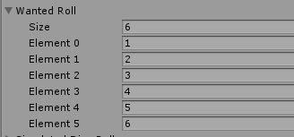

<html xmlns:v="urn:schemas-microsoft-com:vml"
xmlns:o="urn:schemas-microsoft-com:office:office"
xmlns:w="urn:schemas-microsoft-com:office:word"
xmlns:m="http://schemas.microsoft.com/office/2004/12/omml"
xmlns="http://www.w3.org/TR/REC-html40">

<head>
<meta http-equiv=Content-Type content="text/html; charset=windows-1252">
<meta name=ProgId content=Word.Document>
<meta name=Generator content="Microsoft Word 15">
<meta name=Originator content="Microsoft Word 15">
<link rel=File-List href="index_files/filelist.xml">
<link rel=Edit-Time-Data href="index_files/editdata.mso">
<!--[if !mso]>

<![endif]--><!--[if gte mso 9]><xml>
 <o:DocumentProperties>
  <o:Author>redvsgreen</o:Author>
  <o:Template>Normal</o:Template>
  <o:LastAuthor></o:LastAuthor>
  <o:Revision>187</o:Revision>
  <o:TotalTime>219</o:TotalTime>
  <o:LastPrinted>2022-05-11T11:20:00Z</o:LastPrinted>
  <o:Created>2019-08-23T10:01:00Z</o:Created>
  <o:LastSaved>2024-11-30T12:24:00Z</o:LastSaved>
  <o:Pages>15</o:Pages>
  <o:Words>1897</o:Words>
  <o:Characters>10813</o:Characters>
  <o:Lines>90</o:Lines>
  <o:Paragraphs>25</o:Paragraphs>
  <o:CharactersWithSpaces>12685</o:CharactersWithSpaces>
  <o:Version>16.00</o:Version>
 </o:DocumentProperties>
 <o:OfficeDocumentSettings>
  <o:AllowPNG/>
 </o:OfficeDocumentSettings>
</xml><![endif]-->
<link rel=dataStoreItem href="index_files/item0024.xml"
target="index_files/props025.xml">
<link rel=themeData href="index_files/themedata.thmx">
<link rel=colorSchemeMapping href="index_files/colorschememapping.xml">
<!--[if gte mso 9]><xml>
 <w:WordDocument>
  <w:View>Print</w:View>
  <w:ActiveWritingStyle Lang="EN-US" VendorID="64" DLLVersion="6" NLCheck="1">0</w:ActiveWritingStyle>
  <w:ActiveWritingStyle Lang="EN-US" VendorID="64" DLLVersion="4096" NLCheck="1">0</w:ActiveWritingStyle>
  <w:ActiveWritingStyle VendorID="64" DLLVersion="4096" NLCheck="1">0</w:ActiveWritingStyle>
  <w:ActiveWritingStyle VendorID="64" DLLVersion="4096" NLCheck="1">0</w:ActiveWritingStyle>
  <w:TrackMoves>false</w:TrackMoves>
  <w:TrackFormatting/>
  <w:PunctuationKerning/>
  <w:ValidateAgainstSchemas/>
  <w:SaveIfXMLInvalid>false</w:SaveIfXMLInvalid>
  <w:IgnoreMixedContent>false</w:IgnoreMixedContent>
  <w:AlwaysShowPlaceholderText>false</w:AlwaysShowPlaceholderText>
  <w:DoNotPromoteQF/>
  <w:LidThemeOther>EN-US</w:LidThemeOther>
  <w:LidThemeAsian>X-NONE</w:LidThemeAsian>
  <w:LidThemeComplexScript>X-NONE</w:LidThemeComplexScript>
  <w:Compatibility>
   <w:BreakWrappedTables/>
   <w:SnapToGridInCell/>
   <w:WrapTextWithPunct/>
   <w:UseAsianBreakRules/>
   <w:DontGrowAutofit/>
   <w:SplitPgBreakAndParaMark/>
   <w:EnableOpenTypeKerning/>
   <w:DontFlipMirrorIndents/>
   <w:OverrideTableStyleHps/>
  </w:Compatibility>
  <w:BrowserLevel>MicrosoftInternetExplorer4</w:BrowserLevel>
  <m:mathPr>
   <m:mathFont m:val="Cambria Math"/>
   <m:brkBin m:val="before"/>
   <m:brkBinSub m:val="&#45;-"/>
   <m:smallFrac m:val="off"/>
   <m:dispDef/>
   <m:lMargin m:val="0"/>
   <m:rMargin m:val="0"/>
   <m:defJc m:val="centerGroup"/>
   <m:wrapIndent m:val="1440"/>
   <m:intLim m:val="subSup"/>
   <m:naryLim m:val="undOvr"/>
  </m:mathPr></w:WordDocument>
</xml><![endif]--><!--[if gte mso 9]><xml>
 <w:LatentStyles DefLockedState="false" DefUnhideWhenUsed="false"
  DefSemiHidden="false" DefQFormat="false" DefPriority="99"
  LatentStyleCount="376">
  <w:LsdException Locked="false" Priority="0" QFormat="true" Name="Normal"/>
  <w:LsdException Locked="false" Priority="9" QFormat="true" Name="heading 1"/>
  <w:LsdException Locked="false" Priority="9" SemiHidden="true"
   UnhideWhenUsed="true" QFormat="true" Name="heading 2"/>
  <w:LsdException Locked="false" Priority="9" SemiHidden="true"
   UnhideWhenUsed="true" QFormat="true" Name="heading 3"/>
  <w:LsdException Locked="false" Priority="9" SemiHidden="true"
   UnhideWhenUsed="true" QFormat="true" Name="heading 4"/>
  <w:LsdException Locked="false" Priority="9" SemiHidden="true"
   UnhideWhenUsed="true" QFormat="true" Name="heading 5"/>
  <w:LsdException Locked="false" Priority="9" SemiHidden="true"
   UnhideWhenUsed="true" QFormat="true" Name="heading 6"/>
  <w:LsdException Locked="false" Priority="9" SemiHidden="true"
   UnhideWhenUsed="true" QFormat="true" Name="heading 7"/>
  <w:LsdException Locked="false" Priority="9" SemiHidden="true"
   UnhideWhenUsed="true" QFormat="true" Name="heading 8"/>
  <w:LsdException Locked="false" Priority="9" SemiHidden="true"
   UnhideWhenUsed="true" QFormat="true" Name="heading 9"/>
  <w:LsdException Locked="false" SemiHidden="true" UnhideWhenUsed="true"
   Name="index 1"/>
  <w:LsdException Locked="false" SemiHidden="true" UnhideWhenUsed="true"
   Name="index 2"/>
  <w:LsdException Locked="false" SemiHidden="true" UnhideWhenUsed="true"
   Name="index 3"/>
  <w:LsdException Locked="false" SemiHidden="true" UnhideWhenUsed="true"
   Name="index 4"/>
  <w:LsdException Locked="false" SemiHidden="true" UnhideWhenUsed="true"
   Name="index 5"/>
  <w:LsdException Locked="false" SemiHidden="true" UnhideWhenUsed="true"
   Name="index 6"/>
  <w:LsdException Locked="false" SemiHidden="true" UnhideWhenUsed="true"
   Name="index 7"/>
  <w:LsdException Locked="false" SemiHidden="true" UnhideWhenUsed="true"
   Name="index 8"/>
  <w:LsdException Locked="false" SemiHidden="true" UnhideWhenUsed="true"
   Name="index 9"/>
  <w:LsdException Locked="false" Priority="39" SemiHidden="true"
   UnhideWhenUsed="true" Name="toc 1"/>
  <w:LsdException Locked="false" Priority="39" SemiHidden="true"
   UnhideWhenUsed="true" Name="toc 2"/>
  <w:LsdException Locked="false" Priority="39" SemiHidden="true"
   UnhideWhenUsed="true" Name="toc 3"/>
  <w:LsdException Locked="false" Priority="39" SemiHidden="true"
   UnhideWhenUsed="true" Name="toc 4"/>
  <w:LsdException Locked="false" Priority="39" SemiHidden="true"
   UnhideWhenUsed="true" Name="toc 5"/>
  <w:LsdException Locked="false" Priority="39" SemiHidden="true"
   UnhideWhenUsed="true" Name="toc 6"/>
  <w:LsdException Locked="false" Priority="39" SemiHidden="true"
   UnhideWhenUsed="true" Name="toc 7"/>
  <w:LsdException Locked="false" Priority="39" SemiHidden="true"
   UnhideWhenUsed="true" Name="toc 8"/>
  <w:LsdException Locked="false" Priority="39" SemiHidden="true"
   UnhideWhenUsed="true" Name="toc 9"/>
  <w:LsdException Locked="false" SemiHidden="true" UnhideWhenUsed="true"
   Name="Normal Indent"/>
  <w:LsdException Locked="false" SemiHidden="true" UnhideWhenUsed="true"
   Name="footnote text"/>
  <w:LsdException Locked="false" SemiHidden="true" UnhideWhenUsed="true"
   Name="annotation text"/>
  <w:LsdException Locked="false" SemiHidden="true" UnhideWhenUsed="true"
   Name="header"/>
  <w:LsdException Locked="false" SemiHidden="true" UnhideWhenUsed="true"
   Name="footer"/>
  <w:LsdException Locked="false" SemiHidden="true" UnhideWhenUsed="true"
   Name="index heading"/>
  <w:LsdException Locked="false" Priority="35" SemiHidden="true"
   UnhideWhenUsed="true" QFormat="true" Name="caption"/>
  <w:LsdException Locked="false" SemiHidden="true" UnhideWhenUsed="true"
   Name="table of figures"/>
  <w:LsdException Locked="false" SemiHidden="true" UnhideWhenUsed="true"
   Name="envelope address"/>
  <w:LsdException Locked="false" SemiHidden="true" UnhideWhenUsed="true"
   Name="envelope return"/>
  <w:LsdException Locked="false" SemiHidden="true" UnhideWhenUsed="true"
   Name="footnote reference"/>
  <w:LsdException Locked="false" SemiHidden="true" UnhideWhenUsed="true"
   Name="annotation reference"/>
  <w:LsdException Locked="false" SemiHidden="true" UnhideWhenUsed="true"
   Name="line number"/>
  <w:LsdException Locked="false" SemiHidden="true" UnhideWhenUsed="true"
   Name="page number"/>
  <w:LsdException Locked="false" SemiHidden="true" UnhideWhenUsed="true"
   Name="endnote reference"/>
  <w:LsdException Locked="false" SemiHidden="true" UnhideWhenUsed="true"
   Name="endnote text"/>
  <w:LsdException Locked="false" SemiHidden="true" UnhideWhenUsed="true"
   Name="table of authorities"/>
  <w:LsdException Locked="false" SemiHidden="true" UnhideWhenUsed="true"
   Name="macro"/>
  <w:LsdException Locked="false" SemiHidden="true" UnhideWhenUsed="true"
   Name="toa heading"/>
  <w:LsdException Locked="false" SemiHidden="true" UnhideWhenUsed="true"
   Name="List"/>
  <w:LsdException Locked="false" SemiHidden="true" UnhideWhenUsed="true"
   Name="List Bullet"/>
  <w:LsdException Locked="false" SemiHidden="true" UnhideWhenUsed="true"
   Name="List Number"/>
  <w:LsdException Locked="false" SemiHidden="true" UnhideWhenUsed="true"
   Name="List 2"/>
  <w:LsdException Locked="false" SemiHidden="true" UnhideWhenUsed="true"
   Name="List 3"/>
  <w:LsdException Locked="false" SemiHidden="true" UnhideWhenUsed="true"
   Name="List 4"/>
  <w:LsdException Locked="false" SemiHidden="true" UnhideWhenUsed="true"
   Name="List 5"/>
  <w:LsdException Locked="false" SemiHidden="true" UnhideWhenUsed="true"
   Name="List Bullet 2"/>
  <w:LsdException Locked="false" SemiHidden="true" UnhideWhenUsed="true"
   Name="List Bullet 3"/>
  <w:LsdException Locked="false" SemiHidden="true" UnhideWhenUsed="true"
   Name="List Bullet 4"/>
  <w:LsdException Locked="false" SemiHidden="true" UnhideWhenUsed="true"
   Name="List Bullet 5"/>
  <w:LsdException Locked="false" SemiHidden="true" UnhideWhenUsed="true"
   Name="List Number 2"/>
  <w:LsdException Locked="false" SemiHidden="true" UnhideWhenUsed="true"
   Name="List Number 3"/>
  <w:LsdException Locked="false" SemiHidden="true" UnhideWhenUsed="true"
   Name="List Number 4"/>
  <w:LsdException Locked="false" SemiHidden="true" UnhideWhenUsed="true"
   Name="List Number 5"/>
  <w:LsdException Locked="false" Priority="10" QFormat="true" Name="Title"/>
  <w:LsdException Locked="false" SemiHidden="true" UnhideWhenUsed="true"
   Name="Closing"/>
  <w:LsdException Locked="false" SemiHidden="true" UnhideWhenUsed="true"
   Name="Signature"/>
  <w:LsdException Locked="false" Priority="1" SemiHidden="true"
   UnhideWhenUsed="true" Name="Default Paragraph Font"/>
  <w:LsdException Locked="false" SemiHidden="true" UnhideWhenUsed="true"
   Name="Body Text"/>
  <w:LsdException Locked="false" SemiHidden="true" UnhideWhenUsed="true"
   Name="Body Text Indent"/>
  <w:LsdException Locked="false" SemiHidden="true" UnhideWhenUsed="true"
   Name="List Continue"/>
  <w:LsdException Locked="false" SemiHidden="true" UnhideWhenUsed="true"
   Name="List Continue 2"/>
  <w:LsdException Locked="false" SemiHidden="true" UnhideWhenUsed="true"
   Name="List Continue 3"/>
  <w:LsdException Locked="false" SemiHidden="true" UnhideWhenUsed="true"
   Name="List Continue 4"/>
  <w:LsdException Locked="false" SemiHidden="true" UnhideWhenUsed="true"
   Name="List Continue 5"/>
  <w:LsdException Locked="false" SemiHidden="true" UnhideWhenUsed="true"
   Name="Message Header"/>
  <w:LsdException Locked="false" Priority="11" QFormat="true" Name="Subtitle"/>
  <w:LsdException Locked="false" SemiHidden="true" UnhideWhenUsed="true"
   Name="Salutation"/>
  <w:LsdException Locked="false" SemiHidden="true" UnhideWhenUsed="true"
   Name="Date"/>
  <w:LsdException Locked="false" SemiHidden="true" UnhideWhenUsed="true"
   Name="Body Text First Indent"/>
  <w:LsdException Locked="false" SemiHidden="true" UnhideWhenUsed="true"
   Name="Body Text First Indent 2"/>
  <w:LsdException Locked="false" SemiHidden="true" UnhideWhenUsed="true"
   Name="Note Heading"/>
  <w:LsdException Locked="false" SemiHidden="true" UnhideWhenUsed="true"
   Name="Body Text 2"/>
  <w:LsdException Locked="false" SemiHidden="true" UnhideWhenUsed="true"
   Name="Body Text 3"/>
  <w:LsdException Locked="false" SemiHidden="true" UnhideWhenUsed="true"
   Name="Body Text Indent 2"/>
  <w:LsdException Locked="false" SemiHidden="true" UnhideWhenUsed="true"
   Name="Body Text Indent 3"/>
  <w:LsdException Locked="false" SemiHidden="true" UnhideWhenUsed="true"
   Name="Block Text"/>
  <w:LsdException Locked="false" SemiHidden="true" UnhideWhenUsed="true"
   Name="Hyperlink"/>
  <w:LsdException Locked="false" SemiHidden="true" UnhideWhenUsed="true"
   Name="FollowedHyperlink"/>
  <w:LsdException Locked="false" Priority="22" QFormat="true" Name="Strong"/>
  <w:LsdException Locked="false" Priority="20" QFormat="true" Name="Emphasis"/>
  <w:LsdException Locked="false" SemiHidden="true" UnhideWhenUsed="true"
   Name="Document Map"/>
  <w:LsdException Locked="false" SemiHidden="true" UnhideWhenUsed="true"
   Name="Plain Text"/>
  <w:LsdException Locked="false" SemiHidden="true" UnhideWhenUsed="true"
   Name="E-mail Signature"/>
  <w:LsdException Locked="false" SemiHidden="true" UnhideWhenUsed="true"
   Name="HTML Top of Form"/>
  <w:LsdException Locked="false" SemiHidden="true" UnhideWhenUsed="true"
   Name="HTML Bottom of Form"/>
  <w:LsdException Locked="false" SemiHidden="true" UnhideWhenUsed="true"
   Name="Normal (Web)"/>
  <w:LsdException Locked="false" SemiHidden="true" UnhideWhenUsed="true"
   Name="HTML Acronym"/>
  <w:LsdException Locked="false" SemiHidden="true" UnhideWhenUsed="true"
   Name="HTML Address"/>
  <w:LsdException Locked="false" SemiHidden="true" UnhideWhenUsed="true"
   Name="HTML Cite"/>
  <w:LsdException Locked="false" SemiHidden="true" UnhideWhenUsed="true"
   Name="HTML Code"/>
  <w:LsdException Locked="false" SemiHidden="true" UnhideWhenUsed="true"
   Name="HTML Definition"/>
  <w:LsdException Locked="false" SemiHidden="true" UnhideWhenUsed="true"
   Name="HTML Keyboard"/>
  <w:LsdException Locked="false" SemiHidden="true" UnhideWhenUsed="true"
   Name="HTML Preformatted"/>
  <w:LsdException Locked="false" SemiHidden="true" UnhideWhenUsed="true"
   Name="HTML Sample"/>
  <w:LsdException Locked="false" SemiHidden="true" UnhideWhenUsed="true"
   Name="HTML Typewriter"/>
  <w:LsdException Locked="false" SemiHidden="true" UnhideWhenUsed="true"
   Name="HTML Variable"/>
  <w:LsdException Locked="false" SemiHidden="true" UnhideWhenUsed="true"
   Name="Normal Table"/>
  <w:LsdException Locked="false" SemiHidden="true" UnhideWhenUsed="true"
   Name="annotation subject"/>
  <w:LsdException Locked="false" SemiHidden="true" UnhideWhenUsed="true"
   Name="No List"/>
  <w:LsdException Locked="false" SemiHidden="true" UnhideWhenUsed="true"
   Name="Outline List 1"/>
  <w:LsdException Locked="false" SemiHidden="true" UnhideWhenUsed="true"
   Name="Outline List 2"/>
  <w:LsdException Locked="false" SemiHidden="true" UnhideWhenUsed="true"
   Name="Outline List 3"/>
  <w:LsdException Locked="false" SemiHidden="true" UnhideWhenUsed="true"
   Name="Table Simple 1"/>
  <w:LsdException Locked="false" SemiHidden="true" UnhideWhenUsed="true"
   Name="Table Simple 2"/>
  <w:LsdException Locked="false" SemiHidden="true" UnhideWhenUsed="true"
   Name="Table Simple 3"/>
  <w:LsdException Locked="false" SemiHidden="true" UnhideWhenUsed="true"
   Name="Table Classic 1"/>
  <w:LsdException Locked="false" SemiHidden="true" UnhideWhenUsed="true"
   Name="Table Classic 2"/>
  <w:LsdException Locked="false" SemiHidden="true" UnhideWhenUsed="true"
   Name="Table Classic 3"/>
  <w:LsdException Locked="false" SemiHidden="true" UnhideWhenUsed="true"
   Name="Table Classic 4"/>
  <w:LsdException Locked="false" SemiHidden="true" UnhideWhenUsed="true"
   Name="Table Colorful 1"/>
  <w:LsdException Locked="false" SemiHidden="true" UnhideWhenUsed="true"
   Name="Table Colorful 2"/>
  <w:LsdException Locked="false" SemiHidden="true" UnhideWhenUsed="true"
   Name="Table Colorful 3"/>
  <w:LsdException Locked="false" SemiHidden="true" UnhideWhenUsed="true"
   Name="Table Columns 1"/>
  <w:LsdException Locked="false" SemiHidden="true" UnhideWhenUsed="true"
   Name="Table Columns 2"/>
  <w:LsdException Locked="false" SemiHidden="true" UnhideWhenUsed="true"
   Name="Table Columns 3"/>
  <w:LsdException Locked="false" SemiHidden="true" UnhideWhenUsed="true"
   Name="Table Columns 4"/>
  <w:LsdException Locked="false" SemiHidden="true" UnhideWhenUsed="true"
   Name="Table Columns 5"/>
  <w:LsdException Locked="false" SemiHidden="true" UnhideWhenUsed="true"
   Name="Table Grid 1"/>
  <w:LsdException Locked="false" SemiHidden="true" UnhideWhenUsed="true"
   Name="Table Grid 2"/>
  <w:LsdException Locked="false" SemiHidden="true" UnhideWhenUsed="true"
   Name="Table Grid 3"/>
  <w:LsdException Locked="false" SemiHidden="true" UnhideWhenUsed="true"
   Name="Table Grid 4"/>
  <w:LsdException Locked="false" SemiHidden="true" UnhideWhenUsed="true"
   Name="Table Grid 5"/>
  <w:LsdException Locked="false" SemiHidden="true" UnhideWhenUsed="true"
   Name="Table Grid 6"/>
  <w:LsdException Locked="false" SemiHidden="true" UnhideWhenUsed="true"
   Name="Table Grid 7"/>
  <w:LsdException Locked="false" SemiHidden="true" UnhideWhenUsed="true"
   Name="Table Grid 8"/>
  <w:LsdException Locked="false" SemiHidden="true" UnhideWhenUsed="true"
   Name="Table List 1"/>
  <w:LsdException Locked="false" SemiHidden="true" UnhideWhenUsed="true"
   Name="Table List 2"/>
  <w:LsdException Locked="false" SemiHidden="true" UnhideWhenUsed="true"
   Name="Table List 3"/>
  <w:LsdException Locked="false" SemiHidden="true" UnhideWhenUsed="true"
   Name="Table List 4"/>
  <w:LsdException Locked="false" SemiHidden="true" UnhideWhenUsed="true"
   Name="Table List 5"/>
  <w:LsdException Locked="false" SemiHidden="true" UnhideWhenUsed="true"
   Name="Table List 6"/>
  <w:LsdException Locked="false" SemiHidden="true" UnhideWhenUsed="true"
   Name="Table List 7"/>
  <w:LsdException Locked="false" SemiHidden="true" UnhideWhenUsed="true"
   Name="Table List 8"/>
  <w:LsdException Locked="false" SemiHidden="true" UnhideWhenUsed="true"
   Name="Table 3D effects 1"/>
  <w:LsdException Locked="false" SemiHidden="true" UnhideWhenUsed="true"
   Name="Table 3D effects 2"/>
  <w:LsdException Locked="false" SemiHidden="true" UnhideWhenUsed="true"
   Name="Table 3D effects 3"/>
  <w:LsdException Locked="false" SemiHidden="true" UnhideWhenUsed="true"
   Name="Table Contemporary"/>
  <w:LsdException Locked="false" SemiHidden="true" UnhideWhenUsed="true"
   Name="Table Elegant"/>
  <w:LsdException Locked="false" SemiHidden="true" UnhideWhenUsed="true"
   Name="Table Professional"/>
  <w:LsdException Locked="false" SemiHidden="true" UnhideWhenUsed="true"
   Name="Table Subtle 1"/>
  <w:LsdException Locked="false" SemiHidden="true" UnhideWhenUsed="true"
   Name="Table Subtle 2"/>
  <w:LsdException Locked="false" SemiHidden="true" UnhideWhenUsed="true"
   Name="Table Web 1"/>
  <w:LsdException Locked="false" SemiHidden="true" UnhideWhenUsed="true"
   Name="Table Web 2"/>
  <w:LsdException Locked="false" SemiHidden="true" UnhideWhenUsed="true"
   Name="Table Web 3"/>
  <w:LsdException Locked="false" SemiHidden="true" UnhideWhenUsed="true"
   Name="Balloon Text"/>
  <w:LsdException Locked="false" Priority="39" Name="Table Grid"/>
  <w:LsdException Locked="false" SemiHidden="true" UnhideWhenUsed="true"
   Name="Table Theme"/>
  <w:LsdException Locked="false" SemiHidden="true" Name="Placeholder Text"/>
  <w:LsdException Locked="false" Priority="1" QFormat="true" Name="No Spacing"/>
  <w:LsdException Locked="false" Priority="60" Name="Light Shading"/>
  <w:LsdException Locked="false" Priority="61" Name="Light List"/>
  <w:LsdException Locked="false" Priority="62" Name="Light Grid"/>
  <w:LsdException Locked="false" Priority="63" Name="Medium Shading 1"/>
  <w:LsdException Locked="false" Priority="64" Name="Medium Shading 2"/>
  <w:LsdException Locked="false" Priority="65" Name="Medium List 1"/>
  <w:LsdException Locked="false" Priority="66" Name="Medium List 2"/>
  <w:LsdException Locked="false" Priority="67" Name="Medium Grid 1"/>
  <w:LsdException Locked="false" Priority="68" Name="Medium Grid 2"/>
  <w:LsdException Locked="false" Priority="69" Name="Medium Grid 3"/>
  <w:LsdException Locked="false" Priority="70" Name="Dark List"/>
  <w:LsdException Locked="false" Priority="71" Name="Colorful Shading"/>
  <w:LsdException Locked="false" Priority="72" Name="Colorful List"/>
  <w:LsdException Locked="false" Priority="73" Name="Colorful Grid"/>
  <w:LsdException Locked="false" Priority="60" Name="Light Shading Accent 1"/>
  <w:LsdException Locked="false" Priority="61" Name="Light List Accent 1"/>
  <w:LsdException Locked="false" Priority="62" Name="Light Grid Accent 1"/>
  <w:LsdException Locked="false" Priority="63" Name="Medium Shading 1 Accent 1"/>
  <w:LsdException Locked="false" Priority="64" Name="Medium Shading 2 Accent 1"/>
  <w:LsdException Locked="false" Priority="65" Name="Medium List 1 Accent 1"/>
  <w:LsdException Locked="false" SemiHidden="true" Name="Revision"/>
  <w:LsdException Locked="false" Priority="34" QFormat="true"
   Name="List Paragraph"/>
  <w:LsdException Locked="false" Priority="29" QFormat="true" Name="Quote"/>
  <w:LsdException Locked="false" Priority="30" QFormat="true"
   Name="Intense Quote"/>
  <w:LsdException Locked="false" Priority="66" Name="Medium List 2 Accent 1"/>
  <w:LsdException Locked="false" Priority="67" Name="Medium Grid 1 Accent 1"/>
  <w:LsdException Locked="false" Priority="68" Name="Medium Grid 2 Accent 1"/>
  <w:LsdException Locked="false" Priority="69" Name="Medium Grid 3 Accent 1"/>
  <w:LsdException Locked="false" Priority="70" Name="Dark List Accent 1"/>
  <w:LsdException Locked="false" Priority="71" Name="Colorful Shading Accent 1"/>
  <w:LsdException Locked="false" Priority="72" Name="Colorful List Accent 1"/>
  <w:LsdException Locked="false" Priority="73" Name="Colorful Grid Accent 1"/>
  <w:LsdException Locked="false" Priority="60" Name="Light Shading Accent 2"/>
  <w:LsdException Locked="false" Priority="61" Name="Light List Accent 2"/>
  <w:LsdException Locked="false" Priority="62" Name="Light Grid Accent 2"/>
  <w:LsdException Locked="false" Priority="63" Name="Medium Shading 1 Accent 2"/>
  <w:LsdException Locked="false" Priority="64" Name="Medium Shading 2 Accent 2"/>
  <w:LsdException Locked="false" Priority="65" Name="Medium List 1 Accent 2"/>
  <w:LsdException Locked="false" Priority="66" Name="Medium List 2 Accent 2"/>
  <w:LsdException Locked="false" Priority="67" Name="Medium Grid 1 Accent 2"/>
  <w:LsdException Locked="false" Priority="68" Name="Medium Grid 2 Accent 2"/>
  <w:LsdException Locked="false" Priority="69" Name="Medium Grid 3 Accent 2"/>
  <w:LsdException Locked="false" Priority="70" Name="Dark List Accent 2"/>
  <w:LsdException Locked="false" Priority="71" Name="Colorful Shading Accent 2"/>
  <w:LsdException Locked="false" Priority="72" Name="Colorful List Accent 2"/>
  <w:LsdException Locked="false" Priority="73" Name="Colorful Grid Accent 2"/>
  <w:LsdException Locked="false" Priority="60" Name="Light Shading Accent 3"/>
  <w:LsdException Locked="false" Priority="61" Name="Light List Accent 3"/>
  <w:LsdException Locked="false" Priority="62" Name="Light Grid Accent 3"/>
  <w:LsdException Locked="false" Priority="63" Name="Medium Shading 1 Accent 3"/>
  <w:LsdException Locked="false" Priority="64" Name="Medium Shading 2 Accent 3"/>
  <w:LsdException Locked="false" Priority="65" Name="Medium List 1 Accent 3"/>
  <w:LsdException Locked="false" Priority="66" Name="Medium List 2 Accent 3"/>
  <w:LsdException Locked="false" Priority="67" Name="Medium Grid 1 Accent 3"/>
  <w:LsdException Locked="false" Priority="68" Name="Medium Grid 2 Accent 3"/>
  <w:LsdException Locked="false" Priority="69" Name="Medium Grid 3 Accent 3"/>
  <w:LsdException Locked="false" Priority="70" Name="Dark List Accent 3"/>
  <w:LsdException Locked="false" Priority="71" Name="Colorful Shading Accent 3"/>
  <w:LsdException Locked="false" Priority="72" Name="Colorful List Accent 3"/>
  <w:LsdException Locked="false" Priority="73" Name="Colorful Grid Accent 3"/>
  <w:LsdException Locked="false" Priority="60" Name="Light Shading Accent 4"/>
  <w:LsdException Locked="false" Priority="61" Name="Light List Accent 4"/>
  <w:LsdException Locked="false" Priority="62" Name="Light Grid Accent 4"/>
  <w:LsdException Locked="false" Priority="63" Name="Medium Shading 1 Accent 4"/>
  <w:LsdException Locked="false" Priority="64" Name="Medium Shading 2 Accent 4"/>
  <w:LsdException Locked="false" Priority="65" Name="Medium List 1 Accent 4"/>
  <w:LsdException Locked="false" Priority="66" Name="Medium List 2 Accent 4"/>
  <w:LsdException Locked="false" Priority="67" Name="Medium Grid 1 Accent 4"/>
  <w:LsdException Locked="false" Priority="68" Name="Medium Grid 2 Accent 4"/>
  <w:LsdException Locked="false" Priority="69" Name="Medium Grid 3 Accent 4"/>
  <w:LsdException Locked="false" Priority="70" Name="Dark List Accent 4"/>
  <w:LsdException Locked="false" Priority="71" Name="Colorful Shading Accent 4"/>
  <w:LsdException Locked="false" Priority="72" Name="Colorful List Accent 4"/>
  <w:LsdException Locked="false" Priority="73" Name="Colorful Grid Accent 4"/>
  <w:LsdException Locked="false" Priority="60" Name="Light Shading Accent 5"/>
  <w:LsdException Locked="false" Priority="61" Name="Light List Accent 5"/>
  <w:LsdException Locked="false" Priority="62" Name="Light Grid Accent 5"/>
  <w:LsdException Locked="false" Priority="63" Name="Medium Shading 1 Accent 5"/>
  <w:LsdException Locked="false" Priority="64" Name="Medium Shading 2 Accent 5"/>
  <w:LsdException Locked="false" Priority="65" Name="Medium List 1 Accent 5"/>
  <w:LsdException Locked="false" Priority="66" Name="Medium List 2 Accent 5"/>
  <w:LsdException Locked="false" Priority="67" Name="Medium Grid 1 Accent 5"/>
  <w:LsdException Locked="false" Priority="68" Name="Medium Grid 2 Accent 5"/>
  <w:LsdException Locked="false" Priority="69" Name="Medium Grid 3 Accent 5"/>
  <w:LsdException Locked="false" Priority="70" Name="Dark List Accent 5"/>
  <w:LsdException Locked="false" Priority="71" Name="Colorful Shading Accent 5"/>
  <w:LsdException Locked="false" Priority="72" Name="Colorful List Accent 5"/>
  <w:LsdException Locked="false" Priority="73" Name="Colorful Grid Accent 5"/>
  <w:LsdException Locked="false" Priority="60" Name="Light Shading Accent 6"/>
  <w:LsdException Locked="false" Priority="61" Name="Light List Accent 6"/>
  <w:LsdException Locked="false" Priority="62" Name="Light Grid Accent 6"/>
  <w:LsdException Locked="false" Priority="63" Name="Medium Shading 1 Accent 6"/>
  <w:LsdException Locked="false" Priority="64" Name="Medium Shading 2 Accent 6"/>
  <w:LsdException Locked="false" Priority="65" Name="Medium List 1 Accent 6"/>
  <w:LsdException Locked="false" Priority="66" Name="Medium List 2 Accent 6"/>
  <w:LsdException Locked="false" Priority="67" Name="Medium Grid 1 Accent 6"/>
  <w:LsdException Locked="false" Priority="68" Name="Medium Grid 2 Accent 6"/>
  <w:LsdException Locked="false" Priority="69" Name="Medium Grid 3 Accent 6"/>
  <w:LsdException Locked="false" Priority="70" Name="Dark List Accent 6"/>
  <w:LsdException Locked="false" Priority="71" Name="Colorful Shading Accent 6"/>
  <w:LsdException Locked="false" Priority="72" Name="Colorful List Accent 6"/>
  <w:LsdException Locked="false" Priority="73" Name="Colorful Grid Accent 6"/>
  <w:LsdException Locked="false" Priority="19" QFormat="true"
   Name="Subtle Emphasis"/>
  <w:LsdException Locked="false" Priority="21" QFormat="true"
   Name="Intense Emphasis"/>
  <w:LsdException Locked="false" Priority="31" QFormat="true"
   Name="Subtle Reference"/>
  <w:LsdException Locked="false" Priority="32" QFormat="true"
   Name="Intense Reference"/>
  <w:LsdException Locked="false" Priority="33" QFormat="true" Name="Book Title"/>
  <w:LsdException Locked="false" Priority="37" SemiHidden="true"
   UnhideWhenUsed="true" Name="Bibliography"/>
  <w:LsdException Locked="false" Priority="39" SemiHidden="true"
   UnhideWhenUsed="true" QFormat="true" Name="TOC Heading"/>
  <w:LsdException Locked="false" Priority="41" Name="Plain Table 1"/>
  <w:LsdException Locked="false" Priority="42" Name="Plain Table 2"/>
  <w:LsdException Locked="false" Priority="43" Name="Plain Table 3"/>
  <w:LsdException Locked="false" Priority="44" Name="Plain Table 4"/>
  <w:LsdException Locked="false" Priority="45" Name="Plain Table 5"/>
  <w:LsdException Locked="false" Priority="40" Name="Grid Table Light"/>
  <w:LsdException Locked="false" Priority="46" Name="Grid Table 1 Light"/>
  <w:LsdException Locked="false" Priority="47" Name="Grid Table 2"/>
  <w:LsdException Locked="false" Priority="48" Name="Grid Table 3"/>
  <w:LsdException Locked="false" Priority="49" Name="Grid Table 4"/>
  <w:LsdException Locked="false" Priority="50" Name="Grid Table 5 Dark"/>
  <w:LsdException Locked="false" Priority="51" Name="Grid Table 6 Colorful"/>
  <w:LsdException Locked="false" Priority="52" Name="Grid Table 7 Colorful"/>
  <w:LsdException Locked="false" Priority="46"
   Name="Grid Table 1 Light Accent 1"/>
  <w:LsdException Locked="false" Priority="47" Name="Grid Table 2 Accent 1"/>
  <w:LsdException Locked="false" Priority="48" Name="Grid Table 3 Accent 1"/>
  <w:LsdException Locked="false" Priority="49" Name="Grid Table 4 Accent 1"/>
  <w:LsdException Locked="false" Priority="50" Name="Grid Table 5 Dark Accent 1"/>
  <w:LsdException Locked="false" Priority="51"
   Name="Grid Table 6 Colorful Accent 1"/>
  <w:LsdException Locked="false" Priority="52"
   Name="Grid Table 7 Colorful Accent 1"/>
  <w:LsdException Locked="false" Priority="46"
   Name="Grid Table 1 Light Accent 2"/>
  <w:LsdException Locked="false" Priority="47" Name="Grid Table 2 Accent 2"/>
  <w:LsdException Locked="false" Priority="48" Name="Grid Table 3 Accent 2"/>
  <w:LsdException Locked="false" Priority="49" Name="Grid Table 4 Accent 2"/>
  <w:LsdException Locked="false" Priority="50" Name="Grid Table 5 Dark Accent 2"/>
  <w:LsdException Locked="false" Priority="51"
   Name="Grid Table 6 Colorful Accent 2"/>
  <w:LsdException Locked="false" Priority="52"
   Name="Grid Table 7 Colorful Accent 2"/>
  <w:LsdException Locked="false" Priority="46"
   Name="Grid Table 1 Light Accent 3"/>
  <w:LsdException Locked="false" Priority="47" Name="Grid Table 2 Accent 3"/>
  <w:LsdException Locked="false" Priority="48" Name="Grid Table 3 Accent 3"/>
  <w:LsdException Locked="false" Priority="49" Name="Grid Table 4 Accent 3"/>
  <w:LsdException Locked="false" Priority="50" Name="Grid Table 5 Dark Accent 3"/>
  <w:LsdException Locked="false" Priority="51"
   Name="Grid Table 6 Colorful Accent 3"/>
  <w:LsdException Locked="false" Priority="52"
   Name="Grid Table 7 Colorful Accent 3"/>
  <w:LsdException Locked="false" Priority="46"
   Name="Grid Table 1 Light Accent 4"/>
  <w:LsdException Locked="false" Priority="47" Name="Grid Table 2 Accent 4"/>
  <w:LsdException Locked="false" Priority="48" Name="Grid Table 3 Accent 4"/>
  <w:LsdException Locked="false" Priority="49" Name="Grid Table 4 Accent 4"/>
  <w:LsdException Locked="false" Priority="50" Name="Grid Table 5 Dark Accent 4"/>
  <w:LsdException Locked="false" Priority="51"
   Name="Grid Table 6 Colorful Accent 4"/>
  <w:LsdException Locked="false" Priority="52"
   Name="Grid Table 7 Colorful Accent 4"/>
  <w:LsdException Locked="false" Priority="46"
   Name="Grid Table 1 Light Accent 5"/>
  <w:LsdException Locked="false" Priority="47" Name="Grid Table 2 Accent 5"/>
  <w:LsdException Locked="false" Priority="48" Name="Grid Table 3 Accent 5"/>
  <w:LsdException Locked="false" Priority="49" Name="Grid Table 4 Accent 5"/>
  <w:LsdException Locked="false" Priority="50" Name="Grid Table 5 Dark Accent 5"/>
  <w:LsdException Locked="false" Priority="51"
   Name="Grid Table 6 Colorful Accent 5"/>
  <w:LsdException Locked="false" Priority="52"
   Name="Grid Table 7 Colorful Accent 5"/>
  <w:LsdException Locked="false" Priority="46"
   Name="Grid Table 1 Light Accent 6"/>
  <w:LsdException Locked="false" Priority="47" Name="Grid Table 2 Accent 6"/>
  <w:LsdException Locked="false" Priority="48" Name="Grid Table 3 Accent 6"/>
  <w:LsdException Locked="false" Priority="49" Name="Grid Table 4 Accent 6"/>
  <w:LsdException Locked="false" Priority="50" Name="Grid Table 5 Dark Accent 6"/>
  <w:LsdException Locked="false" Priority="51"
   Name="Grid Table 6 Colorful Accent 6"/>
  <w:LsdException Locked="false" Priority="52"
   Name="Grid Table 7 Colorful Accent 6"/>
  <w:LsdException Locked="false" Priority="46" Name="List Table 1 Light"/>
  <w:LsdException Locked="false" Priority="47" Name="List Table 2"/>
  <w:LsdException Locked="false" Priority="48" Name="List Table 3"/>
  <w:LsdException Locked="false" Priority="49" Name="List Table 4"/>
  <w:LsdException Locked="false" Priority="50" Name="List Table 5 Dark"/>
  <w:LsdException Locked="false" Priority="51" Name="List Table 6 Colorful"/>
  <w:LsdException Locked="false" Priority="52" Name="List Table 7 Colorful"/>
  <w:LsdException Locked="false" Priority="46"
   Name="List Table 1 Light Accent 1"/>
  <w:LsdException Locked="false" Priority="47" Name="List Table 2 Accent 1"/>
  <w:LsdException Locked="false" Priority="48" Name="List Table 3 Accent 1"/>
  <w:LsdException Locked="false" Priority="49" Name="List Table 4 Accent 1"/>
  <w:LsdException Locked="false" Priority="50" Name="List Table 5 Dark Accent 1"/>
  <w:LsdException Locked="false" Priority="51"
   Name="List Table 6 Colorful Accent 1"/>
  <w:LsdException Locked="false" Priority="52"
   Name="List Table 7 Colorful Accent 1"/>
  <w:LsdException Locked="false" Priority="46"
   Name="List Table 1 Light Accent 2"/>
  <w:LsdException Locked="false" Priority="47" Name="List Table 2 Accent 2"/>
  <w:LsdException Locked="false" Priority="48" Name="List Table 3 Accent 2"/>
  <w:LsdException Locked="false" Priority="49" Name="List Table 4 Accent 2"/>
  <w:LsdException Locked="false" Priority="50" Name="List Table 5 Dark Accent 2"/>
  <w:LsdException Locked="false" Priority="51"
   Name="List Table 6 Colorful Accent 2"/>
  <w:LsdException Locked="false" Priority="52"
   Name="List Table 7 Colorful Accent 2"/>
  <w:LsdException Locked="false" Priority="46"
   Name="List Table 1 Light Accent 3"/>
  <w:LsdException Locked="false" Priority="47" Name="List Table 2 Accent 3"/>
  <w:LsdException Locked="false" Priority="48" Name="List Table 3 Accent 3"/>
  <w:LsdException Locked="false" Priority="49" Name="List Table 4 Accent 3"/>
  <w:LsdException Locked="false" Priority="50" Name="List Table 5 Dark Accent 3"/>
  <w:LsdException Locked="false" Priority="51"
   Name="List Table 6 Colorful Accent 3"/>
  <w:LsdException Locked="false" Priority="52"
   Name="List Table 7 Colorful Accent 3"/>
  <w:LsdException Locked="false" Priority="46"
   Name="List Table 1 Light Accent 4"/>
  <w:LsdException Locked="false" Priority="47" Name="List Table 2 Accent 4"/>
  <w:LsdException Locked="false" Priority="48" Name="List Table 3 Accent 4"/>
  <w:LsdException Locked="false" Priority="49" Name="List Table 4 Accent 4"/>
  <w:LsdException Locked="false" Priority="50" Name="List Table 5 Dark Accent 4"/>
  <w:LsdException Locked="false" Priority="51"
   Name="List Table 6 Colorful Accent 4"/>
  <w:LsdException Locked="false" Priority="52"
   Name="List Table 7 Colorful Accent 4"/>
  <w:LsdException Locked="false" Priority="46"
   Name="List Table 1 Light Accent 5"/>
  <w:LsdException Locked="false" Priority="47" Name="List Table 2 Accent 5"/>
  <w:LsdException Locked="false" Priority="48" Name="List Table 3 Accent 5"/>
  <w:LsdException Locked="false" Priority="49" Name="List Table 4 Accent 5"/>
  <w:LsdException Locked="false" Priority="50" Name="List Table 5 Dark Accent 5"/>
  <w:LsdException Locked="false" Priority="51"
   Name="List Table 6 Colorful Accent 5"/>
  <w:LsdException Locked="false" Priority="52"
   Name="List Table 7 Colorful Accent 5"/>
  <w:LsdException Locked="false" Priority="46"
   Name="List Table 1 Light Accent 6"/>
  <w:LsdException Locked="false" Priority="47" Name="List Table 2 Accent 6"/>
  <w:LsdException Locked="false" Priority="48" Name="List Table 3 Accent 6"/>
  <w:LsdException Locked="false" Priority="49" Name="List Table 4 Accent 6"/>
  <w:LsdException Locked="false" Priority="50" Name="List Table 5 Dark Accent 6"/>
  <w:LsdException Locked="false" Priority="51"
   Name="List Table 6 Colorful Accent 6"/>
  <w:LsdException Locked="false" Priority="52"
   Name="List Table 7 Colorful Accent 6"/>
  <w:LsdException Locked="false" SemiHidden="true" UnhideWhenUsed="true"
   Name="Mention"/>
  <w:LsdException Locked="false" SemiHidden="true" UnhideWhenUsed="true"
   Name="Smart Hyperlink"/>
  <w:LsdException Locked="false" SemiHidden="true" UnhideWhenUsed="true"
   Name="Hashtag"/>
  <w:LsdException Locked="false" SemiHidden="true" UnhideWhenUsed="true"
   Name="Unresolved Mention"/>
  <w:LsdException Locked="false" SemiHidden="true" UnhideWhenUsed="true"
   Name="Smart Link"/>
 </w:LatentStyles>
</xml><![endif]-->
<!--
 /* Font Definitions */
 @font-face
	{font-family:Wingdings;
	panose-1:5 0 0 0 0 0 0 0 0 0;
	mso-font-charset:2;
	mso-generic-font-family:auto;
	mso-font-pitch:variable;
	mso-font-signature:0 268435456 0 0 -2147483648 0;}
@font-face
	{font-family:"Cambria Math";
	panose-1:2 4 5 3 5 4 6 3 2 4;
	mso-font-charset:0;
	mso-generic-font-family:roman;
	mso-font-pitch:variable;
	mso-font-signature:-536869121 1107305727 33554432 0 415 0;}
@font-face
	{font-family:Calibri;
	panose-1:2 15 5 2 2 2 4 3 2 4;
	mso-font-charset:0;
	mso-generic-font-family:swiss;
	mso-font-pitch:variable;
	mso-font-signature:-469750017 -1040178053 9 0 511 0;}
@font-face
	{font-family:"Calibri Light";
	panose-1:2 15 3 2 2 2 4 3 2 4;
	mso-font-charset:0;
	mso-generic-font-family:swiss;
	mso-font-pitch:variable;
	mso-font-signature:-469750017 -1040178053 9 0 511 0;}
@font-face
	{font-family:"Segoe UI";
	panose-1:2 11 5 2 4 2 4 2 2 3;
	mso-font-charset:0;
	mso-generic-font-family:swiss;
	mso-font-pitch:variable;
	mso-font-signature:-469750017 -1073683329 9 0 511 0;}
@font-face
	{font-family:Consolas;
	panose-1:2 11 6 9 2 2 4 3 2 4;
	mso-font-charset:0;
	mso-generic-font-family:modern;
	mso-font-pitch:fixed;
	mso-font-signature:-536869121 64767 1 0 415 0;}
 /* Style Definitions */
 p.MsoNormal, li.MsoNormal, div.MsoNormal
	{mso-style-unhide:no;
	mso-style-qformat:yes;
	mso-style-parent:"";
	margin-top:0cm;
	margin-right:0cm;
	margin-bottom:8.0pt;
	margin-left:0cm;
	line-height:105%;
	mso-pagination:widow-orphan;
	font-size:11.0pt;
	font-family:"Calibri",sans-serif;
	mso-ascii-font-family:Calibri;
	mso-ascii-theme-font:minor-latin;
	mso-fareast-font-family:Calibri;
	mso-fareast-theme-font:minor-latin;
	mso-hansi-font-family:Calibri;
	mso-hansi-theme-font:minor-latin;
	mso-bidi-font-family:"Times New Roman";
	mso-bidi-theme-font:minor-bidi;}
h1
	{mso-style-priority:9;
	mso-style-unhide:no;
	mso-style-qformat:yes;
	mso-style-link:"Heading 1 Char";
	mso-style-next:Normal;
	margin-top:12.0pt;
	margin-right:0cm;
	margin-bottom:0cm;
	margin-left:0cm;
	line-height:105%;
	mso-pagination:widow-orphan lines-together;
	page-break-after:avoid;
	mso-outline-level:1;
	font-size:16.0pt;
	font-family:"Calibri Light",sans-serif;
	mso-ascii-font-family:"Calibri Light";
	mso-ascii-theme-font:major-latin;
	mso-fareast-font-family:"Times New Roman";
	mso-fareast-theme-font:major-fareast;
	mso-hansi-font-family:"Calibri Light";
	mso-hansi-theme-font:major-latin;
	mso-bidi-font-family:"Times New Roman";
	mso-bidi-theme-font:major-bidi;
	color:#2F5496;
	mso-themecolor:accent1;
	mso-themeshade:191;
	mso-font-kerning:0pt;
	font-weight:normal;}
h2
	{mso-style-noshow:yes;
	mso-style-priority:9;
	mso-style-qformat:yes;
	mso-style-link:"Heading 2 Char";
	mso-style-next:Normal;
	margin-top:2.0pt;
	margin-right:0cm;
	margin-bottom:0cm;
	margin-left:0cm;
	line-height:105%;
	mso-pagination:widow-orphan lines-together;
	page-break-after:avoid;
	mso-outline-level:2;
	font-size:13.0pt;
	font-family:"Calibri Light",sans-serif;
	mso-ascii-font-family:"Calibri Light";
	mso-ascii-theme-font:major-latin;
	mso-fareast-font-family:"Times New Roman";
	mso-fareast-theme-font:major-fareast;
	mso-hansi-font-family:"Calibri Light";
	mso-hansi-theme-font:major-latin;
	mso-bidi-font-family:"Times New Roman";
	mso-bidi-theme-font:major-bidi;
	color:#2F5496;
	mso-themecolor:accent1;
	mso-themeshade:191;
	font-weight:normal;}
p.MsoToc1, li.MsoToc1, div.MsoToc1
	{mso-style-update:auto;
	mso-style-noshow:yes;
	mso-style-priority:39;
	mso-style-next:Normal;
	margin-top:0cm;
	margin-right:0cm;
	margin-bottom:5.0pt;
	margin-left:0cm;
	line-height:105%;
	mso-pagination:widow-orphan;
	font-size:11.0pt;
	font-family:"Calibri",sans-serif;
	mso-ascii-font-family:Calibri;
	mso-ascii-theme-font:minor-latin;
	mso-fareast-font-family:Calibri;
	mso-fareast-theme-font:minor-latin;
	mso-hansi-font-family:Calibri;
	mso-hansi-theme-font:minor-latin;
	mso-bidi-font-family:"Times New Roman";
	mso-bidi-theme-font:minor-bidi;}
p.MsoToc2, li.MsoToc2, div.MsoToc2
	{mso-style-update:auto;
	mso-style-noshow:yes;
	mso-style-priority:39;
	mso-style-next:Normal;
	margin-top:0cm;
	margin-right:0cm;
	margin-bottom:5.0pt;
	margin-left:11.0pt;
	line-height:105%;
	mso-pagination:widow-orphan;
	font-size:11.0pt;
	font-family:"Calibri",sans-serif;
	mso-ascii-font-family:Calibri;
	mso-ascii-theme-font:minor-latin;
	mso-fareast-font-family:Calibri;
	mso-fareast-theme-font:minor-latin;
	mso-hansi-font-family:Calibri;
	mso-hansi-theme-font:minor-latin;
	mso-bidi-font-family:"Times New Roman";
	mso-bidi-theme-font:minor-bidi;}
p.MsoTitle, li.MsoTitle, div.MsoTitle
	{mso-style-noshow:yes;
	mso-style-priority:10;
	mso-style-unhide:no;
	mso-style-qformat:yes;
	mso-style-link:"Title Char";
	mso-style-next:Normal;
	margin:0cm;
	mso-add-space:auto;
	mso-pagination:widow-orphan;
	font-size:28.0pt;
	font-family:"Calibri Light",sans-serif;
	mso-ascii-font-family:"Calibri Light";
	mso-ascii-theme-font:major-latin;
	mso-fareast-font-family:"Times New Roman";
	mso-fareast-theme-font:major-fareast;
	mso-hansi-font-family:"Calibri Light";
	mso-hansi-theme-font:major-latin;
	mso-bidi-font-family:"Times New Roman";
	mso-bidi-theme-font:major-bidi;
	letter-spacing:-.5pt;
	mso-font-kerning:14.0pt;}
p.MsoTitleCxSpFirst, li.MsoTitleCxSpFirst, div.MsoTitleCxSpFirst
	{mso-style-noshow:yes;
	mso-style-priority:10;
	mso-style-unhide:no;
	mso-style-qformat:yes;
	mso-style-link:"Title Char";
	mso-style-next:Normal;
	mso-style-type:export-only;
	margin:0cm;
	mso-add-space:auto;
	mso-pagination:widow-orphan;
	font-size:28.0pt;
	font-family:"Calibri Light",sans-serif;
	mso-ascii-font-family:"Calibri Light";
	mso-ascii-theme-font:major-latin;
	mso-fareast-font-family:"Times New Roman";
	mso-fareast-theme-font:major-fareast;
	mso-hansi-font-family:"Calibri Light";
	mso-hansi-theme-font:major-latin;
	mso-bidi-font-family:"Times New Roman";
	mso-bidi-theme-font:major-bidi;
	letter-spacing:-.5pt;
	mso-font-kerning:14.0pt;}
p.MsoTitleCxSpMiddle, li.MsoTitleCxSpMiddle, div.MsoTitleCxSpMiddle
	{mso-style-noshow:yes;
	mso-style-priority:10;
	mso-style-unhide:no;
	mso-style-qformat:yes;
	mso-style-link:"Title Char";
	mso-style-next:Normal;
	mso-style-type:export-only;
	margin:0cm;
	mso-add-space:auto;
	mso-pagination:widow-orphan;
	font-size:28.0pt;
	font-family:"Calibri Light",sans-serif;
	mso-ascii-font-family:"Calibri Light";
	mso-ascii-theme-font:major-latin;
	mso-fareast-font-family:"Times New Roman";
	mso-fareast-theme-font:major-fareast;
	mso-hansi-font-family:"Calibri Light";
	mso-hansi-theme-font:major-latin;
	mso-bidi-font-family:"Times New Roman";
	mso-bidi-theme-font:major-bidi;
	letter-spacing:-.5pt;
	mso-font-kerning:14.0pt;}
p.MsoTitleCxSpLast, li.MsoTitleCxSpLast, div.MsoTitleCxSpLast
	{mso-style-noshow:yes;
	mso-style-priority:10;
	mso-style-unhide:no;
	mso-style-qformat:yes;
	mso-style-link:"Title Char";
	mso-style-next:Normal;
	mso-style-type:export-only;
	margin:0cm;
	mso-add-space:auto;
	mso-pagination:widow-orphan;
	font-size:28.0pt;
	font-family:"Calibri Light",sans-serif;
	mso-ascii-font-family:"Calibri Light";
	mso-ascii-theme-font:major-latin;
	mso-fareast-font-family:"Times New Roman";
	mso-fareast-theme-font:major-fareast;
	mso-hansi-font-family:"Calibri Light";
	mso-hansi-theme-font:major-latin;
	mso-bidi-font-family:"Times New Roman";
	mso-bidi-theme-font:major-bidi;
	letter-spacing:-.5pt;
	mso-font-kerning:14.0pt;}
p.MsoSubtitle, li.MsoSubtitle, div.MsoSubtitle
	{mso-style-noshow:yes;
	mso-style-priority:11;
	mso-style-unhide:no;
	mso-style-qformat:yes;
	mso-style-link:"Subtitle Char";
	mso-style-next:Normal;
	margin-top:0cm;
	margin-right:0cm;
	margin-bottom:8.0pt;
	margin-left:0cm;
	line-height:105%;
	mso-pagination:widow-orphan;
	font-size:11.0pt;
	font-family:"Calibri",sans-serif;
	mso-ascii-font-family:Calibri;
	mso-ascii-theme-font:minor-latin;
	mso-fareast-font-family:"Times New Roman";
	mso-fareast-theme-font:minor-fareast;
	mso-hansi-font-family:Calibri;
	mso-hansi-theme-font:minor-latin;
	mso-bidi-font-family:"Times New Roman";
	mso-bidi-theme-font:minor-bidi;
	letter-spacing:.75pt;}
a:link, span.MsoHyperlink
	{mso-style-noshow:yes;
	mso-style-priority:99;
	color:#0563C1;
	mso-themecolor:hyperlink;
	text-decoration:underline;
	text-underline:single;}
a:visited, span.MsoHyperlinkFollowed
	{mso-style-noshow:yes;
	mso-style-priority:99;
	color:#954F72;
	mso-themecolor:followedhyperlink;
	text-decoration:underline;
	text-underline:single;}
p
	{mso-style-noshow:yes;
	mso-style-priority:99;
	mso-margin-top-alt:auto;
	margin-right:0cm;
	mso-margin-bottom-alt:auto;
	margin-left:0cm;
	mso-pagination:widow-orphan;
	font-size:11.0pt;
	font-family:"Calibri",sans-serif;
	mso-fareast-font-family:"Times New Roman";
	mso-fareast-theme-font:minor-fareast;}
p.MsoAcetate, li.MsoAcetate, div.MsoAcetate
	{mso-style-noshow:yes;
	mso-style-priority:99;
	mso-style-link:"Balloon Text Char";
	margin:0cm;
	mso-pagination:widow-orphan;
	font-size:9.0pt;
	font-family:"Segoe UI",sans-serif;
	mso-fareast-font-family:Calibri;
	mso-fareast-theme-font:minor-latin;}
p.MsoListParagraph, li.MsoListParagraph, div.MsoListParagraph
	{mso-style-noshow:yes;
	mso-style-priority:34;
	mso-style-unhide:no;
	mso-style-qformat:yes;
	margin-top:0cm;
	margin-right:0cm;
	margin-bottom:8.0pt;
	margin-left:36.0pt;
	mso-add-space:auto;
	line-height:105%;
	mso-pagination:widow-orphan;
	font-size:11.0pt;
	font-family:"Calibri",sans-serif;
	mso-ascii-font-family:Calibri;
	mso-ascii-theme-font:minor-latin;
	mso-fareast-font-family:Calibri;
	mso-fareast-theme-font:minor-latin;
	mso-hansi-font-family:Calibri;
	mso-hansi-theme-font:minor-latin;
	mso-bidi-font-family:"Times New Roman";
	mso-bidi-theme-font:minor-bidi;}
p.MsoListParagraphCxSpFirst, li.MsoListParagraphCxSpFirst, div.MsoListParagraphCxSpFirst
	{mso-style-noshow:yes;
	mso-style-priority:34;
	mso-style-unhide:no;
	mso-style-qformat:yes;
	mso-style-type:export-only;
	margin-top:0cm;
	margin-right:0cm;
	margin-bottom:0cm;
	margin-left:36.0pt;
	mso-add-space:auto;
	line-height:105%;
	mso-pagination:widow-orphan;
	font-size:11.0pt;
	font-family:"Calibri",sans-serif;
	mso-ascii-font-family:Calibri;
	mso-ascii-theme-font:minor-latin;
	mso-fareast-font-family:Calibri;
	mso-fareast-theme-font:minor-latin;
	mso-hansi-font-family:Calibri;
	mso-hansi-theme-font:minor-latin;
	mso-bidi-font-family:"Times New Roman";
	mso-bidi-theme-font:minor-bidi;}
p.MsoListParagraphCxSpMiddle, li.MsoListParagraphCxSpMiddle, div.MsoListParagraphCxSpMiddle
	{mso-style-noshow:yes;
	mso-style-priority:34;
	mso-style-unhide:no;
	mso-style-qformat:yes;
	mso-style-type:export-only;
	margin-top:0cm;
	margin-right:0cm;
	margin-bottom:0cm;
	margin-left:36.0pt;
	mso-add-space:auto;
	line-height:105%;
	mso-pagination:widow-orphan;
	font-size:11.0pt;
	font-family:"Calibri",sans-serif;
	mso-ascii-font-family:Calibri;
	mso-ascii-theme-font:minor-latin;
	mso-fareast-font-family:Calibri;
	mso-fareast-theme-font:minor-latin;
	mso-hansi-font-family:Calibri;
	mso-hansi-theme-font:minor-latin;
	mso-bidi-font-family:"Times New Roman";
	mso-bidi-theme-font:minor-bidi;}
p.MsoListParagraphCxSpLast, li.MsoListParagraphCxSpLast, div.MsoListParagraphCxSpLast
	{mso-style-noshow:yes;
	mso-style-priority:34;
	mso-style-unhide:no;
	mso-style-qformat:yes;
	mso-style-type:export-only;
	margin-top:0cm;
	margin-right:0cm;
	margin-bottom:8.0pt;
	margin-left:36.0pt;
	mso-add-space:auto;
	line-height:105%;
	mso-pagination:widow-orphan;
	font-size:11.0pt;
	font-family:"Calibri",sans-serif;
	mso-ascii-font-family:Calibri;
	mso-ascii-theme-font:minor-latin;
	mso-fareast-font-family:Calibri;
	mso-fareast-theme-font:minor-latin;
	mso-hansi-font-family:Calibri;
	mso-hansi-theme-font:minor-latin;
	mso-bidi-font-family:"Times New Roman";
	mso-bidi-theme-font:minor-bidi;}
span.MsoSubtleEmphasis
	{mso-style-priority:19;
	mso-style-unhide:no;
	mso-style-qformat:yes;
	color:#404040;
	mso-themecolor:text1;
	mso-themetint:191;
	font-style:italic;}
p.MsoTocHeading, li.MsoTocHeading, div.MsoTocHeading
	{mso-style-noshow:yes;
	mso-style-priority:39;
	mso-style-qformat:yes;
	mso-style-parent:"Heading 1";
	mso-style-next:Normal;
	margin-top:12.0pt;
	margin-right:0cm;
	margin-bottom:0cm;
	margin-left:0cm;
	line-height:105%;
	mso-pagination:widow-orphan lines-together;
	page-break-after:avoid;
	font-size:16.0pt;
	font-family:"Calibri Light",sans-serif;
	mso-ascii-font-family:"Calibri Light";
	mso-ascii-theme-font:major-latin;
	mso-fareast-font-family:"Times New Roman";
	mso-fareast-theme-font:major-fareast;
	mso-hansi-font-family:"Calibri Light";
	mso-hansi-theme-font:major-latin;
	mso-bidi-font-family:"Times New Roman";
	mso-bidi-theme-font:major-bidi;
	color:#2F5496;
	mso-themecolor:accent1;
	mso-themeshade:191;}
span.Heading1Char
	{mso-style-name:"Heading 1 Char";
	mso-style-priority:9;
	mso-style-unhide:no;
	mso-style-locked:yes;
	mso-style-link:"Heading 1";
	mso-ansi-font-size:16.0pt;
	mso-bidi-font-size:16.0pt;
	font-family:"Calibri Light",sans-serif;
	mso-ascii-font-family:"Calibri Light";
	mso-ascii-theme-font:major-latin;
	mso-fareast-font-family:"Times New Roman";
	mso-fareast-theme-font:major-fareast;
	mso-hansi-font-family:"Calibri Light";
	mso-hansi-theme-font:major-latin;
	mso-bidi-font-family:"Times New Roman";
	mso-bidi-theme-font:major-bidi;
	color:#2F5496;
	mso-themecolor:accent1;
	mso-themeshade:191;}
span.Heading2Char
	{mso-style-name:"Heading 2 Char";
	mso-style-noshow:yes;
	mso-style-priority:9;
	mso-style-unhide:no;
	mso-style-locked:yes;
	mso-style-link:"Heading 2";
	mso-ansi-font-size:13.0pt;
	mso-bidi-font-size:13.0pt;
	font-family:"Calibri Light",sans-serif;
	mso-ascii-font-family:"Calibri Light";
	mso-ascii-theme-font:major-latin;
	mso-fareast-font-family:"Times New Roman";
	mso-fareast-theme-font:major-fareast;
	mso-hansi-font-family:"Calibri Light";
	mso-hansi-theme-font:major-latin;
	mso-bidi-font-family:"Times New Roman";
	mso-bidi-theme-font:major-bidi;
	color:#2F5496;
	mso-themecolor:accent1;
	mso-themeshade:191;}
p.msonormal0, li.msonormal0, div.msonormal0
	{mso-style-name:msonormal;
	mso-style-noshow:yes;
	mso-style-priority:99;
	mso-style-unhide:no;
	mso-margin-top-alt:auto;
	margin-right:0cm;
	mso-margin-bottom-alt:auto;
	margin-left:0cm;
	mso-pagination:widow-orphan;
	font-size:12.0pt;
	font-family:"Times New Roman",serif;
	mso-fareast-font-family:"Times New Roman";
	mso-fareast-theme-font:minor-fareast;}
span.TitleChar
	{mso-style-name:"Title Char";
	mso-style-priority:10;
	mso-style-unhide:no;
	mso-style-locked:yes;
	mso-style-link:Title;
	mso-ansi-font-size:28.0pt;
	mso-bidi-font-size:28.0pt;
	font-family:"Calibri Light",sans-serif;
	mso-ascii-font-family:"Calibri Light";
	mso-ascii-theme-font:major-latin;
	mso-fareast-font-family:"Times New Roman";
	mso-fareast-theme-font:major-fareast;
	mso-hansi-font-family:"Calibri Light";
	mso-hansi-theme-font:major-latin;
	mso-bidi-font-family:"Times New Roman";
	mso-bidi-theme-font:major-bidi;
	letter-spacing:-.5pt;
	mso-font-kerning:14.0pt;}
span.SubtitleChar
	{mso-style-name:"Subtitle Char";
	mso-style-priority:11;
	mso-style-unhide:no;
	mso-style-locked:yes;
	mso-style-link:Subtitle;
	mso-ansi-font-size:11.0pt;
	mso-bidi-font-size:11.0pt;
	font-family:"Times New Roman",serif;
	mso-ascii-font-family:"Times New Roman";
	mso-fareast-font-family:"Times New Roman";
	mso-fareast-theme-font:minor-fareast;
	mso-hansi-font-family:"Times New Roman";
	mso-bidi-font-family:"Times New Roman";
	letter-spacing:.75pt;}
span.BalloonTextChar
	{mso-style-name:"Balloon Text Char";
	mso-style-noshow:yes;
	mso-style-priority:99;
	mso-style-unhide:no;
	mso-style-locked:yes;
	mso-style-link:"Balloon Text";
	mso-ansi-font-size:9.0pt;
	mso-bidi-font-size:9.0pt;
	font-family:"Segoe UI",sans-serif;
	mso-ascii-font-family:"Segoe UI";
	mso-hansi-font-family:"Segoe UI";
	mso-bidi-font-family:"Segoe UI";
	color:#595959;
	mso-themecolor:text1;
	mso-themetint:166;}
.MsoChpDefault
	{mso-style-type:export-only;
	mso-default-props:yes;
	font-size:10.0pt;
	mso-ansi-font-size:10.0pt;
	mso-bidi-font-size:10.0pt;
	font-family:"Calibri",sans-serif;
	mso-ascii-font-family:Calibri;
	mso-ascii-theme-font:minor-latin;
	mso-fareast-font-family:Calibri;
	mso-fareast-theme-font:minor-latin;
	mso-hansi-font-family:Calibri;
	mso-hansi-theme-font:minor-latin;
	mso-bidi-font-family:"Times New Roman";
	mso-bidi-theme-font:minor-bidi;
	mso-font-kerning:0pt;
	mso-ligatures:none;}
@page WordSection1
	{size:612.0pt 792.0pt;
	margin:72.0pt 72.0pt 72.0pt 72.0pt;
	mso-header-margin:36.0pt;
	mso-footer-margin:36.0pt;
	mso-paper-source:0;}
div.WordSection1
	{page:WordSection1;}
 /* List Definitions */
 @list l0
	{mso-list-id:481701742;
	mso-list-type:hybrid;
	mso-list-template-ids:152965708 -1755558552 67698691 67698693 67698689 67698691 67698693 67698689 67698691 67698693;}
@list l0:level1
	{mso-level-number-format:bullet;
	mso-level-text:\F0B7;
	mso-level-tab-stop:none;
	mso-level-number-position:left;
	text-indent:-18.0pt;
	font-family:Symbol;
	mso-fareast-font-family:"Times New Roman";
	mso-fareast-theme-font:minor-fareast;
	mso-bidi-font-family:"Times New Roman";
	mso-bidi-theme-font:minor-bidi;}
@list l0:level2
	{mso-level-number-format:bullet;
	mso-level-text:o;
	mso-level-tab-stop:none;
	mso-level-number-position:left;
	text-indent:-18.0pt;
	font-family:"Courier New";}
@list l0:level3
	{mso-level-number-format:bullet;
	mso-level-text:\F0A7;
	mso-level-tab-stop:none;
	mso-level-number-position:left;
	text-indent:-18.0pt;
	font-family:Wingdings;}
@list l0:level4
	{mso-level-number-format:bullet;
	mso-level-text:\F0B7;
	mso-level-tab-stop:none;
	mso-level-number-position:left;
	text-indent:-18.0pt;
	font-family:Symbol;}
@list l0:level5
	{mso-level-number-format:bullet;
	mso-level-text:o;
	mso-level-tab-stop:none;
	mso-level-number-position:left;
	text-indent:-18.0pt;
	font-family:"Courier New";}
@list l0:level6
	{mso-level-number-format:bullet;
	mso-level-text:\F0A7;
	mso-level-tab-stop:none;
	mso-level-number-position:left;
	text-indent:-18.0pt;
	font-family:Wingdings;}
@list l0:level7
	{mso-level-number-format:bullet;
	mso-level-text:\F0B7;
	mso-level-tab-stop:none;
	mso-level-number-position:left;
	text-indent:-18.0pt;
	font-family:Symbol;}
@list l0:level8
	{mso-level-number-format:bullet;
	mso-level-text:o;
	mso-level-tab-stop:none;
	mso-level-number-position:left;
	text-indent:-18.0pt;
	font-family:"Courier New";}
@list l0:level9
	{mso-level-number-format:bullet;
	mso-level-text:\F0A7;
	mso-level-tab-stop:none;
	mso-level-number-position:left;
	text-indent:-18.0pt;
	font-family:Wingdings;}
@list l1
	{mso-list-id:1071153063;
	mso-list-type:hybrid;
	mso-list-template-ids:117357172 67698703 67698713 67698715 67698703 67698713 67698715 67698703 67698713 67698715;}
@list l1:level1
	{mso-level-tab-stop:none;
	mso-level-number-position:left;
	text-indent:-18.0pt;}
@list l1:level2
	{mso-level-number-format:alpha-lower;
	mso-level-tab-stop:none;
	mso-level-number-position:left;
	text-indent:-18.0pt;}
@list l1:level3
	{mso-level-number-format:roman-lower;
	mso-level-tab-stop:none;
	mso-level-number-position:right;
	text-indent:-9.0pt;}
@list l1:level4
	{mso-level-tab-stop:none;
	mso-level-number-position:left;
	text-indent:-18.0pt;}
@list l1:level5
	{mso-level-number-format:alpha-lower;
	mso-level-tab-stop:none;
	mso-level-number-position:left;
	text-indent:-18.0pt;}
@list l1:level6
	{mso-level-number-format:roman-lower;
	mso-level-tab-stop:none;
	mso-level-number-position:right;
	text-indent:-9.0pt;}
@list l1:level7
	{mso-level-tab-stop:none;
	mso-level-number-position:left;
	text-indent:-18.0pt;}
@list l1:level8
	{mso-level-number-format:alpha-lower;
	mso-level-tab-stop:none;
	mso-level-number-position:left;
	text-indent:-18.0pt;}
@list l1:level9
	{mso-level-number-format:roman-lower;
	mso-level-tab-stop:none;
	mso-level-number-position:right;
	text-indent:-9.0pt;}
ol
	{margin-bottom:0cm;}
ul
	{margin-bottom:0cm;}
-->
<!--[if gte mso 10]>

<![endif]--><!--[if gte mso 9]><xml>
 <o:shapedefaults v:ext="edit" spidmax="1026"/>
</xml><![endif]--><!--[if gte mso 9]><xml>
 <o:shapelayout v:ext="edit">
  <o:idmap v:ext="edit" data="1"/>
 </o:shapelayout></xml><![endif]-->
</head>

<body lang=en-SE link="#0563C1" vlink="#954F72" style='tab-interval:36.0pt;
word-wrap:break-word'>

<h1><a name="_Toc32834917">Deterministic
Dice Roller Documentation</a><o:p></o:p></h1>

 
Contents<o:p></o:p><w:sdtPr></w:sdtPr>

 
<!--[if supportFields]>TOC \o &quot;1-3&quot; \h \z \u <![endif]--><a href="#_Toc32834917">Deterministic Dice Roller Documentation. <!--[if supportFields]> PAGEREF
 _Toc32834917 \h <![endif]-->1<!--[if gte mso 9]><xml>
  <w:data>08D0C9EA79F9BACE118C8200AA004BA90B02000000080000000D0000005F0054006F006300330032003800330034003900310037000000</w:data>
 </xml><![endif]--><!--[if supportFields]><![endif]--></a><o:p></o:p>

 
<a href="#_Toc32834918">Supported Versions. <!--[if supportFields]> PAGEREF
 _Toc32834918 \h <![endif]-->1<!--[if gte mso 9]><xml>
  <w:data>08D0C9EA79F9BACE118C8200AA004BA90B02000000080000000D0000005F0054006F006300330032003800330034003900310038000000</w:data>
 </xml><![endif]--><!--[if supportFields]><![endif]--></a><o:p></o:p>

 
<a href="#_Toc32834919">Release Notes. <!--[if supportFields]> PAGEREF
 _Toc32834919 \h <![endif]-->1<!--[if gte mso 9]><xml>
  <w:data>08D0C9EA79F9BACE118C8200AA004BA90B02000000080000000D0000005F0054006F006300330032003800330034003900310039000000</w:data>
 </xml><![endif]--><!--[if supportFields]><![endif]--></a><o:p></o:p>

 
<a href="#_Toc32834920">FAQ/Troubleshooting. <!--[if supportFields]> PAGEREF
 _Toc32834920 \h <![endif]-->2<!--[if gte mso 9]><xml>
  <w:data>08D0C9EA79F9BACE118C8200AA004BA90B02000000080000000D0000005F0054006F006300330032003800330034003900320030000000</w:data>
 </xml><![endif]--><!--[if supportFields]><![endif]--></a><o:p></o:p>

 
<a href="#_Toc32834921">Quick install guide. <!--[if supportFields]> PAGEREF
 _Toc32834921 \h <![endif]-->4<!--[if gte mso 9]><xml>
  <w:data>08D0C9EA79F9BACE118C8200AA004BA90B02000000080000000D0000005F0054006F006300330032003800330034003900320031000000</w:data>
 </xml><![endif]--><!--[if supportFields]><![endif]--></a><o:p></o:p>

 
<a href="#_Toc32834922">Components. <!--[if supportFields]> PAGEREF
 _Toc32834922 \h <![endif]-->7<!--[if gte mso 9]><xml>
  <w:data>08D0C9EA79F9BACE118C8200AA004BA90B02000000080000000D0000005F0054006F006300330032003800330034003900320032000000</w:data>
 </xml><![endif]--><!--[if supportFields]><![endif]--></a><o:p></o:p>

 
<a href="#_Toc32834923">Settings. <!--[if supportFields]> PAGEREF
 _Toc32834923 \h <![endif]-->8<!--[if gte mso 9]><xml>
  <w:data>08D0C9EA79F9BACE118C8200AA004BA90B02000000080000000D0000005F0054006F006300330032003800330034003900320033000000</w:data>
 </xml><![endif]--><!--[if supportFields]><![endif]--></a><o:p></o:p>

 
<a href="#_Toc32834924">SkullDice. <!--[if supportFields]> PAGEREF
 _Toc32834924 \h <![endif]-->12<!--[if gte mso 9]><xml>
  <w:data>08D0C9EA79F9BACE118C8200AA004BA90B02000000080000000D0000005F0054006F006300330032003800330034003900320034000000</w:data>
 </xml><![endif]--><!--[if supportFields]><![endif]--></a><o:p></o:p>

 
<a href="#_Toc32834925">Roadmap. <!--[if supportFields]> PAGEREF
 _Toc32834925 \h <![endif]-->12<!--[if gte mso 9]><xml>
  <w:data>08D0C9EA79F9BACE118C8200AA004BA90B02000000080000000D0000005F0054006F006300330032003800330034003900320035000000</w:data>
 </xml><![endif]--><!--[if supportFields]><![endif]--></a><o:p></o:p>

 
<!--[if supportFields]><b></b><![endif]--><o:p>&nbsp;</o:p>

</w:Sdt>

<h2><o:p>&nbsp;</o:p></h2>

<h2><a name="_Toc32834918">Supported
Versions</a><o:p></o:p></h2>

<o:p>&nbsp;</o:p>

Tested and
supported for Unity version:<o:p></o:p>

2018.3<o:p></o:p>

2019.1<o:p></o:p>

2019.2<o:p></o:p>

2019.4<o:p></o:p>

2020.3 LTS<o:p></o:p>

Unity 6<o:p></o:p>

<o:p>&nbsp;</o:p>

<h2><a name="_Toc32834919">Release
Notes</a><o:p></o:p></h2>

<o:p>&nbsp;</o:p>

1.0<o:p></o:p>

Initial
release.<o:p></o:p>

1.1<o:p></o:p>

Fixed a bug
where if the dice landed below x=0 it had some issues finding the top roll.<o:p></o:p>

Added Set
Kinematic which sets all other rigidbodies to set Kinematic during the
Simulation and unsets them afterwards.<o:p></o:p>

1.2<o:p></o:p>

SkullDice
added.<o:p></o:p>

1.3<o:p></o:p>

Updated for
2020.3<o:p></o:p>

Removed
physics objects that could cause dices to incorrectly show the right number.<o:p></o:p>

1.4<o:p></o:p>

Added
D8 and D20 dices.<o:p></o:p>

Added
25 new handpainted textures.<o:p></o:p>

 
Added 3 new Physics handling modes:<o:p></o:p>

Set
Kinematic.<o:p></o:p>

Collide
with Rigidbodies.<o:p></o:p>

Collide
with Rigidbodies and Freeze.<o:p></o:p>

&nbsp;<o:p></o:p>

These
physics handling modes are for when there are lot of rigidbodies in the scene
the dices can collide with, provides better handling for those scenarios.<o:p></o:p>

 
Performance enchancements.<o:p></o:p>

Cleanup
in code.<o:p></o:p>

&nbsp;<o:p></o:p>

Added
another skulldice (does not work to roll deterministically.)<o:p></o:p>

<o:p>&nbsp;</o:p>

1.5<o:p></o:p>

Added
support for Unity 2D mode (Gravity is Z 9.81 ).<o:p></o:p>

Added D4,
D10, D12, D16 dices (And 32 textures for the dices)<o:p></o:p>

<o:p>&nbsp;</o:p>

1.6<o:p></o:p>

Added
truncated D4.<o:p></o:p>

Exposed the
direction Vector so you can choose the direction you want to throw the dices
without making changes to the code.<o:p></o:p>

Added
physics bounciness material for those who wants more bounciness.<o:p></o:p>

Cleaned
some code.<o:p></o:p>

1.7<o:p></o:p>

Refactor<o:p></o:p>

1.8<o:p></o:p>

Support for
unity 6<o:p></o:p>

<o:p>&nbsp;</o:p>

<h2><o:p>&nbsp;</o:p></h2>

<h2><a name="_Toc32834920">FAQ/Troubleshooting</a><o:p></o:p></h2>

<o:p>&nbsp;</o:p>

<![if !supportLists]>&nbsp;&nbsp;&nbsp;&nbsp;
<![endif]>Why
is there a difference in speed when doing a normal roll and a deterministic
roll?<o:p></o:p>

A normal
roll uses the Gravity settings of unity, while a deterministic roll uses the
replay speed setting. Change the replay speed setting/or gravity settings to
suit your needs.<o:p></o:p>

<![if !supportLists]>&nbsp;&nbsp;&nbsp;&nbsp;
<![endif]>I
receive Warning WARNING: Dice D6Deterministic (X) (UnityEngine.GameObject) did
not finish the simulation! Most likely it fell of the board/disappeared. Did
you add to much force to it? in the logs?<o:p></o:p>

This
happens when the dices are not able to finish the simulations within the
default step value (Default is 2000 steps). This usually happens when you dont
have any colliders on the plane, and they fall off. Make sure all dices come to
rest. Preferably as quickly as possible.<o:p></o:p>

<![if !supportLists]>&nbsp;&nbsp;&nbsp;&nbsp; <![endif]>All assets are purple when opening the package!<o:p></o:p>

<!--[if gte vml 1]><v:shapetype id="_x0000_t75" coordsize="21600,21600"
 o:spt="75" o:preferrelative="t" path="m@4@5l@4@11@9@11@9@5xe" filled="f"
 stroked="f">
 <v:stroke joinstyle="miter"/>
 <v:formulas>
  <v:f eqn="if lineDrawn pixelLineWidth 0"/>
  <v:f eqn="sum @0 1 0"/>
  <v:f eqn="sum 0 0 @1"/>
  <v:f eqn="prod @2 1 2"/>
  <v:f eqn="prod @3 21600 pixelWidth"/>
  <v:f eqn="prod @3 21600 pixelHeight"/>
  <v:f eqn="sum @0 0 1"/>
  <v:f eqn="prod @6 1 2"/>
  <v:f eqn="prod @7 21600 pixelWidth"/>
  <v:f eqn="sum @8 21600 0"/>
  <v:f eqn="prod @7 21600 pixelHeight"/>
  <v:f eqn="sum @10 21600 0"/>
 </v:formulas>
 <v:path o:extrusionok="f" gradientshapeok="t" o:connecttype="rect"/>
 <o:lock v:ext="edit" aspectratio="t"/>
</v:shapetype><v:shape id="_x0000_i1040" type="#_x0000_t75" style='width:371.4pt;
 height:205.8pt;visibility:visible;mso-wrap-style:square'>
 <v:imagedata src="index_files/image014.png" o:title=""/>
</v:shape><![endif]--><![if !vml]><![endif]><o:p></o:p>

If
you use URP or HDRP you need to convert the materials to URP/HDRP:<o:p></o:p>

<!--[if gte vml 1]><v:shape id="Picture_x0020_15" o:spid="_x0000_i1039"
 type="#_x0000_t75" style='width:580.8pt;height:85.8pt;visibility:visible;
 mso-wrap-style:square'>
 <v:imagedata src="index_files/image015.emz" o:title=""/>
</v:shape><![endif]--><![if !vml]><![endif]><o:p></o:p>

<![if !supportLists]>&nbsp;&nbsp;&nbsp;&nbsp; <![endif]>How can we achieve different initial trajectories for
the dice? Like throw them downwards or left or right etc.<o:p></o:p>

By
setting the Force Direction: <o:p></o:p>

Example:
X=100 will throw the dices from left to right<o:p></o:p>

<!--[if gte vml 1]><v:shape id="_x0000_i1038" type="#_x0000_t75"
 style='width:289.8pt;height:29.4pt;visibility:visible;mso-wrap-style:square'>
 <v:imagedata src="index_files/image013.png" o:title=""/>
</v:shape><![endif]--><![if !vml]><![endif]><o:p></o:p>

<o:p>&nbsp;</o:p>

<![if !supportLists]>&nbsp;&nbsp;&nbsp;&nbsp; <![endif]>Is there a way to increase the bounciness of the
dices?<o:p></o:p>

A
physics bounciness material is included:<o:p></o:p>

<!--[if gte vml 1]><v:shape id="_x0000_i1037" type="#_x0000_t75"
 style='width:159.6pt;height:165.6pt;visibility:visible;mso-wrap-style:square'>
 <v:imagedata src="index_files/image019.png" o:title=""/>
</v:shape><![endif]--><![if !vml]><![endif]><o:p></o:p>

Add
this to the dices and it will increase bounciness:<o:p></o:p>

<!--[if gte vml 1]><v:shape id="_x0000_i1036" type="#_x0000_t75"
 style='width:278.4pt;height:705pt;visibility:visible;mso-wrap-style:square'>
 <v:imagedata src="index_files/image020.png" o:title=""/>
</v:shape><![endif]--><![if !vml]><![endif]><o:p></o:p>

Settings
for bounciness can be modified on the material<o:p></o:p>

<o:p>&nbsp;</o:p>

<h2><a name="_Toc32834921">Quick
install guide</a><o:p></o:p></h2>

<o:p>&nbsp;</o:p>

The fastest
way to get going with your project:<o:p></o:p>

<![if !supportLists]>1.&nbsp;&nbsp;&nbsp;&nbsp;&nbsp; <![endif]>Import the package via the asset
store<o:p></o:p>

<![if !supportLists]>2.&nbsp;&nbsp;&nbsp;&nbsp;&nbsp; <![endif]>Drag the prefab
under DeterministicDice-&gt;Resources-&gt;Prefabs-&gt;DeterministicDice to the
Unity project hierarchy<o:p></o:p>

<!--[if gte vml 1]><v:shape id="Picture_x0020_2"
 o:spid="_x0000_i1035" type="#_x0000_t75" style='width:309.6pt;height:441pt;
 visibility:visible;mso-wrap-style:square'>
 <v:imagedata src="index_files/image002.png" o:title=""/>
</v:shape><![endif]--><![if !vml]><![endif]><o:p></o:p>

<o:p>&nbsp;</o:p>

<![if !supportLists]>3.&nbsp;&nbsp;&nbsp;&nbsp;&nbsp; <![endif]>Disable UI component - The above
will include the UI as well, this is normally not used so feel free to disable
it. But it can be good for early troubleshooting/testing and setup of the
Deterministic Dice roller.<o:p></o:p>

<!--[if gte vml 1]><v:shape id="Picture_x0020_1"
 o:spid="_x0000_i1034" type="#_x0000_t75" style='width:300pt;height:59.4pt;
 visibility:visible;mso-wrap-style:square'>
 <v:imagedata src="index_files/image003.png" o:title=""/>
</v:shape><![endif]--><![if !vml]><![endif]><o:p></o:p>

<o:p>&nbsp;</o:p>

<![if !supportLists]>4.&nbsp;&nbsp;&nbsp;&nbsp;&nbsp; <![endif]>Scale and correct the positions of
the dices. They are all located under the game object Deterministic Dices. If
you need to change the size of the dices open the D6Deterministic prefab and
change that.<o:p></o:p>

<!--[if gte vml 1]><v:shape id="Picture_x0020_3"
 o:spid="_x0000_i1033" type="#_x0000_t75" style='width:255.6pt;height:85.8pt;
 visibility:visible;mso-wrap-style:square'>
 <v:imagedata src="index_files/image004.png" o:title=""/>
</v:shape><![endif]--><![if !vml]><![endif]><o:p></o:p>

<o:p>&nbsp;</o:p>

<![if !supportLists]>5.&nbsp;&nbsp;&nbsp;&nbsp;&nbsp; <![endif]>Dont forget to place colliders
around the terrain to make sure they dont fall off.<o:p></o:p>

<!--[if gte vml 1]><v:shape id="Picture_x0020_4"
 o:spid="_x0000_i1032" type="#_x0000_t75" style='width:339pt;height:326.4pt;
 visibility:visible;mso-wrap-style:square'>
 <v:imagedata src="index_files/image005.png" o:title=""/>
</v:shape><![endif]--><![if !vml]><![endif]><o:p></o:p>

<o:p>&nbsp;</o:p>

<![if !supportLists]>6.&nbsp;&nbsp;&nbsp;&nbsp;&nbsp; <![endif]>Roll the dices! <o:p></o:p>

All the logic to roll the dices are contained in the
DeterministicDiceRoller gameObject/script:<o:p></o:p>

<!--[if gte vml 1]><v:shape id="Picture_x0020_5"
 o:spid="_x0000_i1031" type="#_x0000_t75" style='width:182.4pt;height:75pt;
 visibility:visible;mso-wrap-style:square'>
 <v:imagedata src="index_files/image006.png" o:title=""/>
</v:shape><![endif]--><![if !vml]><![endif]><o:p></o:p>

<o:p>&nbsp;</o:p>

To roll the dice simply click the check box Roll Dice<o:p></o:p>

<!--[if gte vml 1]><v:shape id="Picture_x0020_6"
 o:spid="_x0000_i1030" type="#_x0000_t75" style='width:250.8pt;height:263.4pt;
 visibility:visible;mso-wrap-style:square'>
 <v:imagedata src="index_files/image007.png" o:title=""/>
</v:shape><![endif]--><![if !vml]><![endif]><o:p></o:p>

<o:p>&nbsp;</o:p>

To do this programmatically create a public variable and populate it
with the diceRollScript:<o:p></o:p>

public DeterministicDiceRoller diceRollScript;<o:p></o:p>

<!--[if gte vml 1]><v:shape
 id="Picture_x0020_8" o:spid="_x0000_i1029" type="#_x0000_t75" style='width:248.4pt;
 height:16.8pt;visibility:visible;mso-wrap-style:square'>
 <v:imagedata src="index_files/image008.png" o:title=""/>
</v:shape><![endif]--><![if !vml]><![endif]><o:p></o:p>

access
the rollDice bool and set it to true:<o:p></o:p>

 // Start is called before the first frame update<o:p></o:p>

 void Start()<o:p></o:p>

 {<o:p></o:p>

 //This is what rolls the dices<o:p></o:p>

 diceRollScript.rollDice = true;<o:p></o:p>

 }<o:p></o:p>

<![if !supportLists]>7.&nbsp;&nbsp;&nbsp;&nbsp;&nbsp; <![endif]>By default the dices will always
roll a 1. This is true as long as you dont populate the list in the
DeterministicDiceRoller called wantedRoll.<o:p></o:p>

There needs to be one wantedRoll entry per dice under the Gameobject
DeterministicDices. If you are rolling 6 dices, then there needs to be 6
entries:<o:p></o:p>

<o:p>&nbsp;</o:p>

<!--[if gte vml 1]><v:shape id="Picture_x0020_9"
 o:spid="_x0000_i1028" type="#_x0000_t75" style='width:246pt;height:114.6pt;
 visibility:visible;mso-wrap-style:square'>
 <v:imagedata src="index_files/image009.png" o:title=""/>
</v:shape><![endif]--><![if !vml]><![endif]><o:p></o:p>

<o:p>&nbsp;</o:p>

To populate it simply add a number(int) to the list:<o:p></o:p>

<o:p>&nbsp;</o:p>

//Add number 5 to the list<o:p></o:p>

diceRollScript.wantedRoll.Add(5);<o:p></o:p>

<o:p>&nbsp;</o:p>

Dont forget to clear the list between the
rolls:<o:p></o:p>

<o:p>&nbsp;</o:p>

diceRollScript.wantedRoll = new List&lt;int&gt;();<o:p></o:p>

<o:p>&nbsp;</o:p>

<![if !supportLists]>8.&nbsp;&nbsp;&nbsp;&nbsp;&nbsp; <![endif]>For your convenience the UI script
buttons1to6 contains all kinds of rolling behavior and control. Please check
it if you feel stuck. <o:p></o:p>

<o:p>&nbsp;</o:p>

<h2><a name="_Toc32834922">Components</a><o:p></o:p></h2>

<o:p>&nbsp;</o:p>

Components
used:<o:p></o:p>

<table class=MsoTableGrid border=1 cellspacing=0 cellpadding=0
 style='border-collapse:collapse;border:none;mso-border-alt:solid windowtext .5pt;
 mso-yfti-tbllook:1184;mso-padding-alt:0cm 5.4pt 0cm 5.4pt'>
 <tr style='mso-yfti-irow:0;mso-yfti-firstrow:yes'>
  <td width=208 valign=top style='width:155.8pt;border:solid windowtext 1.0pt;
  mso-border-alt:solid windowtext .5pt;padding:0cm 5.4pt 0cm 5.4pt'>
  
Name

  </td>
  <td width=208 valign=top style='width:155.85pt;border:solid windowtext 1.0pt;
  border-left:none;mso-border-left-alt:solid windowtext .5pt;mso-border-alt:
  solid windowtext .5pt;padding:0cm 5.4pt 0cm 5.4pt'>
  
Type

  </td>
  <td width=958 valign=top style='width:718.45pt;border:solid windowtext 1.0pt;
  border-left:none;mso-border-left-alt:solid windowtext .5pt;mso-border-alt:
  solid windowtext .5pt;padding:0cm 5.4pt 0cm 5.4pt'>
  
Description

  </td>
 </tr>
 <tr style='mso-yfti-irow:1'>
  <td width=208 valign=top style='width:155.8pt;border:solid windowtext 1.0pt;
  border-top:none;mso-border-top-alt:solid windowtext .5pt;mso-border-alt:solid windowtext .5pt;
  padding:0cm 5.4pt 0cm 5.4pt'>
  
UI

  </td>
  <td width=208 valign=top style='width:155.85pt;border-top:none;border-left:
  none;border-bottom:solid windowtext 1.0pt;border-right:solid windowtext 1.0pt;
  mso-border-top-alt:solid windowtext .5pt;mso-border-left-alt:solid windowtext .5pt;
  mso-border-alt:solid windowtext .5pt;padding:0cm 5.4pt 0cm 5.4pt'>
  
GameObject

  </td>
  <td width=958 valign=top style='width:718.45pt;border-top:none;border-left:
  none;border-bottom:solid windowtext 1.0pt;border-right:solid windowtext 1.0pt;
  mso-border-top-alt:solid windowtext .5pt;mso-border-left-alt:solid windowtext .5pt;
  mso-border-alt:solid windowtext .5pt;padding:0cm 5.4pt 0cm 5.4pt'>
  
UI contains all the buttons/sliders/toggles for testing.
  The idea is to get a feel for how it works, and then disable it.

  </td>
 </tr>
 <tr style='mso-yfti-irow:2'>
  <td width=208 valign=top style='width:155.8pt;border:solid windowtext 1.0pt;
  border-top:none;mso-border-top-alt:solid windowtext .5pt;mso-border-alt:solid windowtext .5pt;
  padding:0cm 5.4pt 0cm 5.4pt'>
  
ButtonController

  </td>
  <td width=208 valign=top style='width:155.85pt;border-top:none;border-left:
  none;border-bottom:solid windowtext 1.0pt;border-right:solid windowtext 1.0pt;
  mso-border-top-alt:solid windowtext .5pt;mso-border-left-alt:solid windowtext .5pt;
  mso-border-alt:solid windowtext .5pt;padding:0cm 5.4pt 0cm 5.4pt'>
  
GameObject

  </td>
  <td width=958 valign=top style='width:718.45pt;border-top:none;border-left:
  none;border-bottom:solid windowtext 1.0pt;border-right:solid windowtext 1.0pt;
  mso-border-top-alt:solid windowtext .5pt;mso-border-left-alt:solid windowtext .5pt;
  mso-border-alt:solid windowtext .5pt;padding:0cm 5.4pt 0cm 5.4pt'>
  
Runs the script Button1to6

  </td>
 </tr>
 <tr style='mso-yfti-irow:3'>
  <td width=208 valign=top style='width:155.8pt;border:solid windowtext 1.0pt;
  border-top:none;mso-border-top-alt:solid windowtext .5pt;mso-border-alt:solid windowtext .5pt;
  padding:0cm 5.4pt 0cm 5.4pt'>
  
DeterministicDiceRoller

  </td>
  <td width=208 valign=top style='width:155.85pt;border-top:none;border-left:
  none;border-bottom:solid windowtext 1.0pt;border-right:solid windowtext 1.0pt;
  mso-border-top-alt:solid windowtext .5pt;mso-border-left-alt:solid windowtext .5pt;
  mso-border-alt:solid windowtext .5pt;padding:0cm 5.4pt 0cm 5.4pt'>
  
GameObject

  </td>
  <td width=958 valign=top style='width:718.45pt;border-top:none;border-left:
  none;border-bottom:solid windowtext 1.0pt;border-right:solid windowtext 1.0pt;
  mso-border-top-alt:solid windowtext .5pt;mso-border-left-alt:solid windowtext .5pt;
  mso-border-alt:solid windowtext .5pt;padding:0cm 5.4pt 0cm 5.4pt'>
  
Runs the script DeterministicDiceRoller

  </td>
 </tr>
 <tr style='mso-yfti-irow:4'>
  <td width=208 valign=top style='width:155.8pt;border:solid windowtext 1.0pt;
  border-top:none;mso-border-top-alt:solid windowtext .5pt;mso-border-alt:solid windowtext .5pt;
  padding:0cm 5.4pt 0cm 5.4pt'>
  
DeterministicDices

  </td>
  <td width=208 valign=top style='width:155.85pt;border-top:none;border-left:
  none;border-bottom:solid windowtext 1.0pt;border-right:solid windowtext 1.0pt;
  mso-border-top-alt:solid windowtext .5pt;mso-border-left-alt:solid windowtext .5pt;
  mso-border-alt:solid windowtext .5pt;padding:0cm 5.4pt 0cm 5.4pt'>
  
GameObject

  </td>
  <td width=958 valign=top style='width:718.45pt;border-top:none;border-left:
  none;border-bottom:solid windowtext 1.0pt;border-right:solid windowtext 1.0pt;
  mso-border-top-alt:solid windowtext .5pt;mso-border-left-alt:solid windowtext .5pt;
  mso-border-alt:solid windowtext .5pt;padding:0cm 5.4pt 0cm 5.4pt'>
  
Holds all the dices. Every ACTIVE dice-GameObject under this GameObject
  will trigger a dice roll. So if you want to roll 3 dices, keep 3 dices active/enabled
  under this GameObject. You can either disable or delete dices to stop them
  from being rolled.

  </td>
 </tr>
 <tr style='mso-yfti-irow:5'>
  <td width=208 valign=top style='width:155.8pt;border:solid windowtext 1.0pt;
  border-top:none;mso-border-top-alt:solid windowtext .5pt;mso-border-alt:solid windowtext .5pt;
  padding:0cm 5.4pt 0cm 5.4pt'>
  
D6Deterministic

  </td>
  <td width=208 valign=top style='width:155.85pt;border-top:none;border-left:
  none;border-bottom:solid windowtext 1.0pt;border-right:solid windowtext 1.0pt;
  mso-border-top-alt:solid windowtext .5pt;mso-border-left-alt:solid windowtext .5pt;
  mso-border-alt:solid windowtext .5pt;padding:0cm 5.4pt 0cm 5.4pt'>
  
GameObject

  </td>
  <td width=958 valign=top style='width:718.45pt;border-top:none;border-left:
  none;border-bottom:solid windowtext 1.0pt;border-right:solid windowtext 1.0pt;
  mso-border-top-alt:solid windowtext .5pt;mso-border-left-alt:solid windowtext .5pt;
  mso-border-alt:solid windowtext .5pt;padding:0cm 5.4pt 0cm 5.4pt'>
  
The dice itself. Runs the script DeterministicDice.

  </td>
 </tr>
 <tr style='mso-yfti-irow:6'>
  <td width=208 valign=top style='width:155.8pt;border:solid windowtext 1.0pt;
  border-top:none;mso-border-top-alt:solid windowtext .5pt;mso-border-alt:solid windowtext .5pt;
  padding:0cm 5.4pt 0cm 5.4pt'>
  
Button1to6

  </td>
  <td width=208 valign=top style='width:155.85pt;border-top:none;border-left:
  none;border-bottom:solid windowtext 1.0pt;border-right:solid windowtext 1.0pt;
  mso-border-top-alt:solid windowtext .5pt;mso-border-left-alt:solid windowtext .5pt;
  mso-border-alt:solid windowtext .5pt;padding:0cm 5.4pt 0cm 5.4pt'>
  
Script

  </td>
  <td width=958 valign=top style='width:718.45pt;border-top:none;border-left:
  none;border-bottom:solid windowtext 1.0pt;border-right:solid windowtext 1.0pt;
  mso-border-top-alt:solid windowtext .5pt;mso-border-left-alt:solid windowtext .5pt;
  mso-border-alt:solid windowtext .5pt;padding:0cm 5.4pt 0cm 5.4pt'>
  
Script for all the UI button logic. Check here if you need
  some inspiration on how to access the settings of DeterministicDiceRoller.

  </td>
 </tr>
 <tr style='mso-yfti-irow:7'>
  <td width=208 valign=top style='width:155.8pt;border:solid windowtext 1.0pt;
  border-top:none;mso-border-top-alt:solid windowtext .5pt;mso-border-alt:solid windowtext .5pt;
  padding:0cm 5.4pt 0cm 5.4pt'>
  
DeterministicDice

  </td>
  <td width=208 valign=top style='width:155.85pt;border-top:none;border-left:
  none;border-bottom:solid windowtext 1.0pt;border-right:solid windowtext 1.0pt;
  mso-border-top-alt:solid windowtext .5pt;mso-border-left-alt:solid windowtext .5pt;
  mso-border-alt:solid windowtext .5pt;padding:0cm 5.4pt 0cm 5.4pt'>
  
Script

  </td>
  <td width=958 valign=top style='width:718.45pt;border-top:none;border-left:
  none;border-bottom:solid windowtext 1.0pt;border-right:solid windowtext 1.0pt;
  mso-border-top-alt:solid windowtext .5pt;mso-border-left-alt:solid windowtext .5pt;
  mso-border-alt:solid windowtext .5pt;padding:0cm 5.4pt 0cm 5.4pt'>
  
The only thing this script does is to report which side is
  up when the dice has stopped rolling. Everything else is done in the
  DeterministicDiceRoller script.

  </td>
 </tr>
 <tr style='mso-yfti-irow:8;mso-yfti-lastrow:yes'>
  <td width=208 valign=top style='width:155.8pt;border:solid windowtext 1.0pt;
  border-top:none;mso-border-top-alt:solid windowtext .5pt;mso-border-alt:solid windowtext .5pt;
  padding:0cm 5.4pt 0cm 5.4pt'>
  
DeterministicDiceRoller

  </td>
  <td width=208 valign=top style='width:155.85pt;border-top:none;border-left:
  none;border-bottom:solid windowtext 1.0pt;border-right:solid windowtext 1.0pt;
  mso-border-top-alt:solid windowtext .5pt;mso-border-left-alt:solid windowtext .5pt;
  mso-border-alt:solid windowtext .5pt;padding:0cm 5.4pt 0cm 5.4pt'>
  
Script

  </td>
  <td width=958 valign=top style='width:718.45pt;border-top:none;border-left:
  none;border-bottom:solid windowtext 1.0pt;border-right:solid windowtext 1.0pt;
  mso-border-top-alt:solid windowtext .5pt;mso-border-left-alt:solid windowtext .5pt;
  mso-border-alt:solid windowtext .5pt;padding:0cm 5.4pt 0cm 5.4pt'>
  
The main logic component of this asset. Contains all
  settings and actions.

  </td>
 </tr>
</table>

<o:p>&nbsp;</o:p>

<h2><a name="_Toc32834923">Settings</a><o:p></o:p></h2>

Deterministic
Dice Settings:<o:p></o:p>

This script
is attached to all dices and handles normal dice rolling as well as defines
what kind of dice we have (D4,D6,D16 etc.)<o:p></o:p>

<!--[if gte vml 1]><v:shape id="Picture_x0020_13" o:spid="_x0000_i1027"
 type="#_x0000_t75" style='width:305.4pt;height:159pt;visibility:visible;
 mso-wrap-style:square'>
 <v:imagedata src="index_files/image010.png" o:title=""/>
</v:shape><![endif]--><![if !vml]><![endif]><o:p></o:p>

<o:p>&nbsp;</o:p>

<table class=MsoTableGrid border=1 cellspacing=0 cellpadding=0
 style='border-collapse:collapse;border:none;mso-border-alt:solid windowtext .5pt;
 mso-yfti-tbllook:1184;mso-padding-alt:0cm 5.4pt 0cm 5.4pt'>
 <tr style='mso-yfti-irow:0;mso-yfti-firstrow:yes'>
  <td width=208 valign=top style='width:155.8pt;border:solid windowtext 1.0pt;
  mso-border-alt:solid windowtext .5pt;padding:0cm 5.4pt 0cm 5.4pt'>
  
Name

  </td>
  <td width=208 valign=top style='width:155.85pt;border:solid windowtext 1.0pt;
  border-left:none;mso-border-left-alt:solid windowtext .5pt;mso-border-alt:
  solid windowtext .5pt;padding:0cm 5.4pt 0cm 5.4pt'>
  
Type

  </td>
  <td width=958 valign=top style='width:718.45pt;border:solid windowtext 1.0pt;
  border-left:none;mso-border-left-alt:solid windowtext .5pt;mso-border-alt:
  solid windowtext .5pt;padding:0cm 5.4pt 0cm 5.4pt'>
  
Description

  </td>
 </tr>
 <tr style='mso-yfti-irow:1'>
  <td width=208 valign=top style='width:155.8pt;border:solid windowtext 1.0pt;
  border-top:none;mso-border-top-alt:solid windowtext .5pt;mso-border-alt:solid windowtext .5pt;
  padding:0cm 5.4pt 0cm 5.4pt'>
  
Mode 2D<o:p></o:p>

  </td>
  <td width=208 valign=top style='width:155.85pt;border-top:none;border-left:
  none;border-bottom:solid windowtext 1.0pt;border-right:solid windowtext 1.0pt;
  mso-border-top-alt:solid windowtext .5pt;mso-border-left-alt:solid windowtext .5pt;
  mso-border-alt:solid windowtext .5pt;padding:0cm 5.4pt 0cm 5.4pt'>
  
Boolean<o:p></o:p>

  </td>
  <td width=958 valign=top style='width:718.45pt;border-top:none;border-left:
  none;border-bottom:solid windowtext 1.0pt;border-right:solid windowtext 1.0pt;
  mso-border-top-alt:solid windowtext .5pt;mso-border-left-alt:solid windowtext .5pt;
  mso-border-alt:solid windowtext .5pt;padding:0cm 5.4pt 0cm 5.4pt'>
  
Set to
  true if you want the dices to work when Gravity is Z=9.81 (Unity Default 2D
  mode) when you are rolling them Normally.<o:p></o:p>

  </td>
 </tr>
 <tr style='mso-yfti-irow:2'>
  <td width=208 valign=top style='width:155.8pt;border:solid windowtext 1.0pt;
  border-top:none;mso-border-top-alt:solid windowtext .5pt;mso-border-alt:solid windowtext .5pt;
  padding:0cm 5.4pt 0cm 5.4pt'>
  
Dice Sleeping<o:p></o:p>

  </td>
  <td width=208 valign=top style='width:155.85pt;border-top:none;border-left:
  none;border-bottom:solid windowtext 1.0pt;border-right:solid windowtext 1.0pt;
  mso-border-top-alt:solid windowtext .5pt;mso-border-left-alt:solid windowtext .5pt;
  mso-border-alt:solid windowtext .5pt;padding:0cm 5.4pt 0cm 5.4pt'>
  
Boolean<o:p></o:p>

  </td>
  <td width=958 valign=top style='width:718.45pt;border-top:none;border-left:
  none;border-bottom:solid windowtext 1.0pt;border-right:solid windowtext 1.0pt;
  mso-border-top-alt:solid windowtext .5pt;mso-border-left-alt:solid windowtext .5pt;
  mso-border-alt:solid windowtext .5pt;padding:0cm 5.4pt 0cm 5.4pt'>
  
Sets
  itself to true when the dices are resting, used to determine when the dices
  has stopped rolling.<o:p></o:p>

  </td>
 </tr>
 <tr style='mso-yfti-irow:3'>
  <td width=208 valign=top style='width:155.8pt;border:solid windowtext 1.0pt;
  border-top:none;mso-border-top-alt:solid windowtext .5pt;mso-border-alt:solid windowtext .5pt;
  padding:0cm 5.4pt 0cm 5.4pt'>
  
Deterministic
  Roll<o:p></o:p>

  </td>
  <td width=208 valign=top style='width:155.85pt;border-top:none;border-left:
  none;border-bottom:solid windowtext 1.0pt;border-right:solid windowtext 1.0pt;
  mso-border-top-alt:solid windowtext .5pt;mso-border-left-alt:solid windowtext .5pt;
  mso-border-alt:solid windowtext .5pt;padding:0cm 5.4pt 0cm 5.4pt'>
  
Boolean<o:p></o:p>

  </td>
  <td width=958 valign=top style='width:718.45pt;border-top:none;border-left:
  none;border-bottom:solid windowtext 1.0pt;border-right:solid windowtext 1.0pt;
  mso-border-top-alt:solid windowtext .5pt;mso-border-left-alt:solid windowtext .5pt;
  mso-border-alt:solid windowtext .5pt;padding:0cm 5.4pt 0cm 5.4pt'>
  
Is set to
  true by the DeterministicDiceRoller script if we are rolling the dices
  deterministically<o:p></o:p>

  </td>
 </tr>
 <tr style='mso-yfti-irow:4'>
  <td width=208 valign=top style='width:155.8pt;border:solid windowtext 1.0pt;
  border-top:none;mso-border-top-alt:solid windowtext .5pt;mso-border-alt:solid windowtext .5pt;
  padding:0cm 5.4pt 0cm 5.4pt'>
  
Dice Roll<o:p></o:p>

  </td>
  <td width=208 valign=top style='width:155.85pt;border-top:none;border-left:
  none;border-bottom:solid windowtext 1.0pt;border-right:solid windowtext 1.0pt;
  mso-border-top-alt:solid windowtext .5pt;mso-border-left-alt:solid windowtext .5pt;
  mso-border-alt:solid windowtext .5pt;padding:0cm 5.4pt 0cm 5.4pt'>
  
Int<o:p></o:p>

  </td>
  <td width=958 valign=top style='width:718.45pt;border-top:none;border-left:
  none;border-bottom:solid windowtext 1.0pt;border-right:solid windowtext 1.0pt;
  mso-border-top-alt:solid windowtext .5pt;mso-border-left-alt:solid windowtext .5pt;
  mso-border-alt:solid windowtext .5pt;padding:0cm 5.4pt 0cm 5.4pt'>
  
Gives the
  number the dice rolled if rolled normally<o:p></o:p>

  </td>
 </tr>
 <tr style='mso-yfti-irow:5'>
  <td width=208 valign=top style='width:155.8pt;border:solid windowtext 1.0pt;
  border-top:none;mso-border-top-alt:solid windowtext .5pt;mso-border-alt:solid windowtext .5pt;
  padding:0cm 5.4pt 0cm 5.4pt'>
  
Dice Roll
  Deterministic<o:p></o:p>

  </td>
  <td width=208 valign=top style='width:155.85pt;border-top:none;border-left:
  none;border-bottom:solid windowtext 1.0pt;border-right:solid windowtext 1.0pt;
  mso-border-top-alt:solid windowtext .5pt;mso-border-left-alt:solid windowtext .5pt;
  mso-border-alt:solid windowtext .5pt;padding:0cm 5.4pt 0cm 5.4pt'>
  
Int<o:p></o:p>

  </td>
  <td width=958 valign=top style='width:718.45pt;border-top:none;border-left:
  none;border-bottom:solid windowtext 1.0pt;border-right:solid windowtext 1.0pt;
  mso-border-top-alt:solid windowtext .5pt;mso-border-left-alt:solid windowtext .5pt;
  mso-border-alt:solid windowtext .5pt;padding:0cm 5.4pt 0cm 5.4pt'>
  
Gives the
  number the dice rolled if rolled deterministically<o:p></o:p>

  </td>
 </tr>
 <tr style='mso-yfti-irow:6'>
  <td width=208 valign=top style='width:155.8pt;border:solid windowtext 1.0pt;
  border-top:none;mso-border-top-alt:solid windowtext .5pt;mso-border-alt:solid windowtext .5pt;
  padding:0cm 5.4pt 0cm 5.4pt'>
  
Dice Type<o:p></o:p>

  </td>
  <td width=208 valign=top style='width:155.85pt;border-top:none;border-left:
  none;border-bottom:solid windowtext 1.0pt;border-right:solid windowtext 1.0pt;
  mso-border-top-alt:solid windowtext .5pt;mso-border-left-alt:solid windowtext .5pt;
  mso-border-alt:solid windowtext .5pt;padding:0cm 5.4pt 0cm 5.4pt'>
  
Enumarator<o:p></o:p>

  </td>
  <td width=958 valign=top style='width:718.45pt;border-top:none;border-left:
  none;border-bottom:solid windowtext 1.0pt;border-right:solid windowtext 1.0pt;
  mso-border-top-alt:solid windowtext .5pt;mso-border-left-alt:solid windowtext .5pt;
  mso-border-alt:solid windowtext .5pt;padding:0cm 5.4pt 0cm 5.4pt'>
  
Set to
  the dicetype. If wrong dicetype is chosen it will not work correctly. Supports: D4,D6,D10,D12,D16,D20<o:p></o:p>

  </td>
 </tr>
 <tr style='mso-yfti-irow:7;mso-yfti-lastrow:yes'>
  <td width=208 valign=top style='width:155.8pt;border:solid windowtext 1.0pt;
  border-top:none;mso-border-top-alt:solid windowtext .5pt;mso-border-alt:solid windowtext .5pt;
  padding:0cm 5.4pt 0cm 5.4pt'>
  
Edgelandinginverter<o:p></o:p>

  </td>
  <td width=208 valign=top style='width:155.85pt;border-top:none;border-left:
  none;border-bottom:solid windowtext 1.0pt;border-right:solid windowtext 1.0pt;
  mso-border-top-alt:solid windowtext .5pt;mso-border-left-alt:solid windowtext .5pt;
  mso-border-alt:solid windowtext .5pt;padding:0cm 5.4pt 0cm 5.4pt'>
  
Boolean<o:p></o:p>

  </td>
  <td width=958 valign=top style='width:718.45pt;border-top:none;border-left:
  none;border-bottom:solid windowtext 1.0pt;border-right:solid windowtext 1.0pt;
  mso-border-top-alt:solid windowtext .5pt;mso-border-left-alt:solid windowtext .5pt;
  mso-border-alt:solid windowtext .5pt;padding:0cm 5.4pt 0cm 5.4pt'>
  
Experimental
  code, do not use.<o:p></o:p>

  </td>
 </tr>
</table>

<o:p>&nbsp;</o:p>

DeterministicDiceRoller
Settings:<o:p></o:p>

<!--[if gte vml 1]><v:shape id="Picture_x0020_12" o:spid="_x0000_i1026"
 type="#_x0000_t75" style='width:303pt;height:373.8pt;visibility:visible;
 mso-wrap-style:square'>
 <v:imagedata src="index_files/image011.png" o:title=""/>
</v:shape><![endif]--><![if !vml]><![endif]><o:p></o:p>

<o:p>&nbsp;</o:p>

<table class=MsoTableGrid border=1 cellspacing=0 cellpadding=0
 style='border-collapse:collapse;border:none;mso-border-alt:solid windowtext .5pt;
 mso-yfti-tbllook:1184;mso-padding-alt:0cm 5.4pt 0cm 5.4pt'>
 <tr style='mso-yfti-irow:0;mso-yfti-firstrow:yes'>
  <td width=208 valign=top style='width:155.8pt;border:solid windowtext 1.0pt;
  mso-border-alt:solid windowtext .5pt;padding:0cm 5.4pt 0cm 5.4pt'>
  
Name

  </td>
  <td width=208 valign=top style='width:155.85pt;border:solid windowtext 1.0pt;
  border-left:none;mso-border-left-alt:solid windowtext .5pt;mso-border-alt:
  solid windowtext .5pt;padding:0cm 5.4pt 0cm 5.4pt'>
  
Type

  </td>
  <td width=958 valign=top style='width:718.45pt;border:solid windowtext 1.0pt;
  border-left:none;mso-border-left-alt:solid windowtext .5pt;mso-border-alt:
  solid windowtext .5pt;padding:0cm 5.4pt 0cm 5.4pt'>
  
Description

  </td>
 </tr>
 <tr style='mso-yfti-irow:1'>
  <td width=208 valign=top style='width:155.8pt;border:solid windowtext 1.0pt;
  border-top:none;mso-border-top-alt:solid windowtext .5pt;mso-border-alt:solid windowtext .5pt;
  padding:0cm 5.4pt 0cm 5.4pt'>
  
Roll Dice

  </td>
  <td width=208 valign=top style='width:155.85pt;border-top:none;border-left:
  none;border-bottom:solid windowtext 1.0pt;border-right:solid windowtext 1.0pt;
  mso-border-top-alt:solid windowtext .5pt;mso-border-left-alt:solid windowtext .5pt;
  mso-border-alt:solid windowtext .5pt;padding:0cm 5.4pt 0cm 5.4pt'>
  
Bool

  </td>
  <td width=958 valign=top style='width:718.45pt;border-top:none;border-left:
  none;border-bottom:solid windowtext 1.0pt;border-right:solid windowtext 1.0pt;
  mso-border-top-alt:solid windowtext .5pt;mso-border-left-alt:solid windowtext .5pt;
  mso-border-alt:solid windowtext .5pt;padding:0cm 5.4pt 0cm 5.4pt'>
  
This is checked every Update() and if true rolls all dices
  under the GameObject DeterministicDices.

  </td>
 </tr>
 <tr style='mso-yfti-irow:2'>
  <td width=208 valign=top style='width:155.8pt;border:solid windowtext 1.0pt;
  border-top:none;mso-border-top-alt:solid windowtext .5pt;mso-border-alt:solid windowtext .5pt;
  padding:0cm 5.4pt 0cm 5.4pt'>
  
Mode 2D

  </td>
  <td width=208 valign=top style='width:155.85pt;border-top:none;border-left:
  none;border-bottom:solid windowtext 1.0pt;border-right:solid windowtext 1.0pt;
  mso-border-top-alt:solid windowtext .5pt;mso-border-left-alt:solid windowtext .5pt;
  mso-border-alt:solid windowtext .5pt;padding:0cm 5.4pt 0cm 5.4pt'>
  
Boolean

  </td>
  <td width=958 valign=top style='width:718.45pt;border-top:none;border-left:
  none;border-bottom:solid windowtext 1.0pt;border-right:solid windowtext 1.0pt;
  mso-border-top-alt:solid windowtext .5pt;mso-border-left-alt:solid windowtext .5pt;
  mso-border-alt:solid windowtext .5pt;padding:0cm 5.4pt 0cm 5.4pt'>
  
Set to
  true if you want the dices to work when Gravity is Z=9.81 (Unity Default 2D
  mode)

  </td>
 </tr>
 <tr style='mso-yfti-irow:3'>
  <td width=208 valign=top style='width:155.8pt;border:solid windowtext 1.0pt;
  border-top:none;mso-border-top-alt:solid windowtext .5pt;mso-border-alt:solid windowtext .5pt;
  padding:0cm 5.4pt 0cm 5.4pt'>
  
Wanted Roll

  </td>
  <td width=208 valign=top style='width:155.85pt;border-top:none;border-left:
  none;border-bottom:solid windowtext 1.0pt;border-right:solid windowtext 1.0pt;
  mso-border-top-alt:solid windowtext .5pt;mso-border-left-alt:solid windowtext .5pt;
  mso-border-alt:solid windowtext .5pt;padding:0cm 5.4pt 0cm 5.4pt'>
  
List&lt;int&gt;

  </td>
  <td width=958 valign=top style='width:718.45pt;border-top:none;border-left:
  none;border-bottom:solid windowtext 1.0pt;border-right:solid windowtext 1.0pt;
  mso-border-top-alt:solid windowtext .5pt;mso-border-left-alt:solid windowtext .5pt;
  mso-border-alt:solid windowtext .5pt;padding:0cm 5.4pt 0cm 5.4pt'>
  
A list containing the rolls we want to make. Defaults to 1
  if not populated. Add 1 entry per dice. In the same order as diceslist.

  </td>
 </tr>
 <tr style='mso-yfti-irow:4'>
  <td width=208 valign=top style='width:155.8pt;border:solid windowtext 1.0pt;
  border-top:none;mso-border-top-alt:solid windowtext .5pt;mso-border-alt:solid windowtext .5pt;
  padding:0cm 5.4pt 0cm 5.4pt'>
  
Simulated Dice Roll

  </td>
  <td width=208 valign=top style='width:155.85pt;border-top:none;border-left:
  none;border-bottom:solid windowtext 1.0pt;border-right:solid windowtext 1.0pt;
  mso-border-top-alt:solid windowtext .5pt;mso-border-left-alt:solid windowtext .5pt;
  mso-border-alt:solid windowtext .5pt;padding:0cm 5.4pt 0cm 5.4pt'>
  
List&lt;int&gt;

  </td>
  <td width=958 valign=top style='width:718.45pt;border-top:none;border-left:
  none;border-bottom:solid windowtext 1.0pt;border-right:solid windowtext 1.0pt;
  mso-border-top-alt:solid windowtext .5pt;mso-border-left-alt:solid windowtext .5pt;
  mso-border-alt:solid windowtext .5pt;padding:0cm 5.4pt 0cm 5.4pt'>
  
A list containing the simulated rolls. Do not change or
  edit.

  </td>
 </tr>
 <tr style='mso-yfti-irow:5'>
  <td width=208 valign=top style='width:155.8pt;border:solid windowtext 1.0pt;
  border-top:none;mso-border-top-alt:solid windowtext .5pt;mso-border-alt:solid windowtext .5pt;
  padding:0cm 5.4pt 0cm 5.4pt'>
  
Dices Game Object

  </td>
  <td width=208 valign=top style='width:155.85pt;border-top:none;border-left:
  none;border-bottom:solid windowtext 1.0pt;border-right:solid windowtext 1.0pt;
  mso-border-top-alt:solid windowtext .5pt;mso-border-left-alt:solid windowtext .5pt;
  mso-border-alt:solid windowtext .5pt;padding:0cm 5.4pt 0cm 5.4pt'>
  
GameObject

  </td>
  <td width=958 valign=top style='width:718.45pt;border-top:none;border-left:
  none;border-bottom:solid windowtext 1.0pt;border-right:solid windowtext 1.0pt;
  mso-border-top-alt:solid windowtext .5pt;mso-border-left-alt:solid windowtext .5pt;
  mso-border-alt:solid windowtext .5pt;padding:0cm 5.4pt 0cm 5.4pt'>
  
The Gameobject that contains all the dices. Default
  DeterministicDices.

  </td>
 </tr>
 <tr style='mso-yfti-irow:6'>
  <td width=208 valign=top style='width:155.8pt;border:solid windowtext 1.0pt;
  border-top:none;mso-border-top-alt:solid windowtext .5pt;mso-border-alt:solid windowtext .5pt;
  padding:0cm 5.4pt 0cm 5.4pt'>
  
Dices List

  </td>
  <td width=208 valign=top style='width:155.85pt;border-top:none;border-left:
  none;border-bottom:solid windowtext 1.0pt;border-right:solid windowtext 1.0pt;
  mso-border-top-alt:solid windowtext .5pt;mso-border-left-alt:solid windowtext .5pt;
  mso-border-alt:solid windowtext .5pt;padding:0cm 5.4pt 0cm 5.4pt'>
  
List&lt;GameObject&gt;

  </td>
  <td width=958 valign=top style='width:718.45pt;border-top:none;border-left:
  none;border-bottom:solid windowtext 1.0pt;border-right:solid windowtext 1.0pt;
  mso-border-top-alt:solid windowtext .5pt;mso-border-left-alt:solid windowtext .5pt;
  mso-border-alt:solid windowtext .5pt;padding:0cm 5.4pt 0cm 5.4pt'>
  
A list containing all the dices to be rolled. It adds all
  Active dices under above GameObject. Do not edit this list, instead
  remove/disable/add/activate dices under the GameObject DeterministicDices.

  </td>
 </tr>
 <tr style='mso-yfti-irow:7'>
  <td width=208 valign=top style='width:155.8pt;border:solid windowtext 1.0pt;
  border-top:none;mso-border-top-alt:solid windowtext .5pt;mso-border-alt:solid windowtext .5pt;
  padding:0cm 5.4pt 0cm 5.4pt'>
  
Dices Sides List<u1:p></u1:p>

  </td>
  <td width=208 valign=top style='width:155.85pt;border-top:none;border-left:
  none;border-bottom:solid windowtext 1.0pt;border-right:solid windowtext 1.0pt;
  mso-border-top-alt:solid windowtext .5pt;mso-border-left-alt:solid windowtext .5pt;
  mso-border-alt:solid windowtext .5pt;padding:0cm 5.4pt 0cm 5.4pt'>
  
List&lt;int&gt;<u1:p></u1:p>

  </td>
  <td width=958 valign=top style='width:718.45pt;border-top:none;border-left:
  none;border-bottom:solid windowtext 1.0pt;border-right:solid windowtext 1.0pt;
  mso-border-top-alt:solid windowtext .5pt;mso-border-left-alt:solid windowtext .5pt;
  mso-border-alt:solid windowtext .5pt;padding:0cm 5.4pt 0cm 5.4pt'>
  
A list containing how many sides each dice has (eg D6, D8, D20)

  </td>
 </tr>
 <tr style='mso-yfti-irow:8'>
  <td width=208 valign=top style='width:155.8pt;border:solid windowtext 1.0pt;
  border-top:none;mso-border-top-alt:solid windowtext .5pt;mso-border-alt:solid windowtext .5pt;
  padding:0cm 5.4pt 0cm 5.4pt'>
  
Return to Origin

  </td>
  <td width=208 valign=top style='width:155.85pt;border-top:none;border-left:
  none;border-bottom:solid windowtext 1.0pt;border-right:solid windowtext 1.0pt;
  mso-border-top-alt:solid windowtext .5pt;mso-border-left-alt:solid windowtext .5pt;
  mso-border-alt:solid windowtext .5pt;padding:0cm 5.4pt 0cm 5.4pt'>
  
Bool

  </td>
  <td width=958 valign=top style='width:718.45pt;border-top:none;border-left:
  none;border-bottom:solid windowtext 1.0pt;border-right:solid windowtext 1.0pt;
  mso-border-top-alt:solid windowtext .5pt;mso-border-left-alt:solid windowtext .5pt;
  mso-border-alt:solid windowtext .5pt;padding:0cm 5.4pt 0cm 5.4pt'>
  
Set this is you want the dices to be moved back to their
  original position between rolls. If disabled dices will be rolled from the
  current position.

  </td>
 </tr>
 <tr style='mso-yfti-irow:9'>
  <td width=208 valign=top style='width:155.8pt;border:solid windowtext 1.0pt;
  border-top:none;mso-border-top-alt:solid windowtext .5pt;mso-border-alt:solid windowtext .5pt;
  padding:0cm 5.4pt 0cm 5.4pt'>
  
Original Position

  </td>
  <td width=208 valign=top style='width:155.85pt;border-top:none;border-left:
  none;border-bottom:solid windowtext 1.0pt;border-right:solid windowtext 1.0pt;
  mso-border-top-alt:solid windowtext .5pt;mso-border-left-alt:solid windowtext .5pt;
  mso-border-alt:solid windowtext .5pt;padding:0cm 5.4pt 0cm 5.4pt'>
  
List&lt;Vector3&gt;

  </td>
  <td width=958 valign=top style='width:718.45pt;border-top:none;border-left:
  none;border-bottom:solid windowtext 1.0pt;border-right:solid windowtext 1.0pt;
  mso-border-top-alt:solid windowtext .5pt;mso-border-left-alt:solid windowtext .5pt;
  mso-border-alt:solid windowtext .5pt;padding:0cm 5.4pt 0cm 5.4pt'>
  
If Return to Origin is true then we will move them to the
  position in this list. Dice1= entry1, Dice2= entry2 etc You can edit this
  between rolls if you want to move them to some specific place before the
  roll. Normally though, its better to just move the dices themselves and leave
  Return to Origin as false.

  </td>
 </tr>
 <tr style='mso-yfti-irow:10'>
  <td width=208 valign=top style='width:155.8pt;border:solid windowtext 1.0pt;
  border-top:none;mso-border-top-alt:solid windowtext .5pt;mso-border-alt:solid windowtext .5pt;
  padding:0cm 5.4pt 0cm 5.4pt'>
  
Original Rotation

  </td>
  <td width=208 valign=top style='width:155.85pt;border-top:none;border-left:
  none;border-bottom:solid windowtext 1.0pt;border-right:solid windowtext 1.0pt;
  mso-border-top-alt:solid windowtext .5pt;mso-border-left-alt:solid windowtext .5pt;
  mso-border-alt:solid windowtext .5pt;padding:0cm 5.4pt 0cm 5.4pt'>
  
List&lt;Vector3&gt;

  </td>
  <td width=958 valign=top style='width:718.45pt;border-top:none;border-left:
  none;border-bottom:solid windowtext 1.0pt;border-right:solid windowtext 1.0pt;
  mso-border-top-alt:solid windowtext .5pt;mso-border-left-alt:solid windowtext .5pt;
  mso-border-alt:solid windowtext .5pt;padding:0cm 5.4pt 0cm 5.4pt'>
  
If Return to Origin is true then we will rotate them to
  the position in this list. Dice1= entry1, Dice2= entry2 etc You can edit
  this between rolls if you want to rotate them to some specific rotation
  before the roll.

  </td>
 </tr>
 <tr style='mso-yfti-irow:11'>
  <td width=208 valign=top style='width:155.8pt;border:solid windowtext 1.0pt;
  border-top:none;mso-border-top-alt:solid windowtext .5pt;mso-border-alt:solid windowtext .5pt;
  padding:0cm 5.4pt 0cm 5.4pt'>
  
Add Force

  </td>
  <td width=208 valign=top style='width:155.85pt;border-top:none;border-left:
  none;border-bottom:solid windowtext 1.0pt;border-right:solid windowtext 1.0pt;
  mso-border-top-alt:solid windowtext .5pt;mso-border-left-alt:solid windowtext .5pt;
  mso-border-alt:solid windowtext .5pt;padding:0cm 5.4pt 0cm 5.4pt'>
  
Bool

  </td>
  <td width=958 valign=top style='width:718.45pt;border-top:none;border-left:
  none;border-bottom:solid windowtext 1.0pt;border-right:solid windowtext 1.0pt;
  mso-border-top-alt:solid windowtext .5pt;mso-border-left-alt:solid windowtext .5pt;
  mso-border-alt:solid windowtext .5pt;padding:0cm 5.4pt 0cm 5.4pt'>
  
Set to true if you want to add random force to the dices
  when rolling. This can be done manually instead.

  </td>
 </tr>
 <tr style='mso-yfti-irow:12'>
  <td width=208 valign=top style='width:155.8pt;border:solid windowtext 1.0pt;
  border-top:none;mso-border-top-alt:solid windowtext .5pt;mso-border-alt:solid windowtext .5pt;
  padding:0cm 5.4pt 0cm 5.4pt'>
  
Force Direction<o:p></o:p>

  </td>
  <td width=208 valign=top style='width:155.85pt;border-top:none;border-left:
  none;border-bottom:solid windowtext 1.0pt;border-right:solid windowtext 1.0pt;
  mso-border-top-alt:solid windowtext .5pt;mso-border-left-alt:solid windowtext .5pt;
  mso-border-alt:solid windowtext .5pt;padding:0cm 5.4pt 0cm 5.4pt'>
  
Vector3<o:p></o:p>

  </td>
  <td width=958 valign=top style='width:718.45pt;border-top:none;border-left:
  none;border-bottom:solid windowtext 1.0pt;border-right:solid windowtext 1.0pt;
  mso-border-top-alt:solid windowtext .5pt;mso-border-left-alt:solid windowtext .5pt;
  mso-border-alt:solid windowtext .5pt;padding:0cm 5.4pt 0cm 5.4pt'>
  
The
  direction you want to throw the dice, example: Set Y = 100 and the dices will
  be thrown upwards. Remember to enable Add Force when using this. The result
  will be cleared if you disable torque during testing.<o:p></o:p>

  </td>
 </tr>
 <tr style='mso-yfti-irow:13'>
  <td width=208 valign=top style='width:155.8pt;border:solid windowtext 1.0pt;
  border-top:none;mso-border-top-alt:solid windowtext .5pt;mso-border-alt:solid windowtext .5pt;
  padding:0cm 5.4pt 0cm 5.4pt'>
  
Force Multiplier

  </td>
  <td width=208 valign=top style='width:155.85pt;border-top:none;border-left:
  none;border-bottom:solid windowtext 1.0pt;border-right:solid windowtext 1.0pt;
  mso-border-top-alt:solid windowtext .5pt;mso-border-left-alt:solid windowtext .5pt;
  mso-border-alt:solid windowtext .5pt;padding:0cm 5.4pt 0cm 5.4pt'>
  
Int

  </td>
  <td width=958 valign=top style='width:718.45pt;border-top:none;border-left:
  none;border-bottom:solid windowtext 1.0pt;border-right:solid windowtext 1.0pt;
  mso-border-top-alt:solid windowtext .5pt;mso-border-left-alt:solid windowtext .5pt;
  mso-border-alt:solid windowtext .5pt;padding:0cm 5.4pt 0cm 5.4pt'>
  
Governs how much force is added when rolling. force =
  force * forceMultiplier.

  </td>
 </tr>
 <tr style='mso-yfti-irow:14'>
  <td width=208 valign=top style='width:155.8pt;border:solid windowtext 1.0pt;
  border-top:none;mso-border-top-alt:solid windowtext .5pt;mso-border-alt:solid windowtext .5pt;
  padding:0cm 5.4pt 0cm 5.4pt'>
  
Add Torque

  </td>
  <td width=208 valign=top style='width:155.85pt;border-top:none;border-left:
  none;border-bottom:solid windowtext 1.0pt;border-right:solid windowtext 1.0pt;
  mso-border-top-alt:solid windowtext .5pt;mso-border-left-alt:solid windowtext .5pt;
  mso-border-alt:solid windowtext .5pt;padding:0cm 5.4pt 0cm 5.4pt'>
  
Bool

  </td>
  <td width=958 valign=top style='width:718.45pt;border-top:none;border-left:
  none;border-bottom:solid windowtext 1.0pt;border-right:solid windowtext 1.0pt;
  mso-border-top-alt:solid windowtext .5pt;mso-border-left-alt:solid windowtext .5pt;
  mso-border-alt:solid windowtext .5pt;padding:0cm 5.4pt 0cm 5.4pt'>
  
Set to true if you want to add random torque to the dices
  when rolling. This can be done manually instead.

  </td>
 </tr>
 <tr style='mso-yfti-irow:15'>
  <td width=208 valign=top style='width:155.8pt;border:solid windowtext 1.0pt;
  border-top:none;mso-border-top-alt:solid windowtext .5pt;mso-border-alt:solid windowtext .5pt;
  padding:0cm 5.4pt 0cm 5.4pt'>
  
Torque Multiplier

  </td>
  <td width=208 valign=top style='width:155.85pt;border-top:none;border-left:
  none;border-bottom:solid windowtext 1.0pt;border-right:solid windowtext 1.0pt;
  mso-border-top-alt:solid windowtext .5pt;mso-border-left-alt:solid windowtext .5pt;
  mso-border-alt:solid windowtext .5pt;padding:0cm 5.4pt 0cm 5.4pt'>
  
Int

  </td>
  <td width=958 valign=top style='width:718.45pt;border-top:none;border-left:
  none;border-bottom:solid windowtext 1.0pt;border-right:solid windowtext 1.0pt;
  mso-border-top-alt:solid windowtext .5pt;mso-border-left-alt:solid windowtext .5pt;
  mso-border-alt:solid windowtext .5pt;padding:0cm 5.4pt 0cm 5.4pt'>
  
Governs how much torque is added when rolling. torque
  =torque * Torque Multiplier.

  </td>
 </tr>
 <tr style='mso-yfti-irow:16'>
  <td width=208 valign=top style='width:155.8pt;border:solid windowtext 1.0pt;
  border-top:none;mso-border-top-alt:solid windowtext .5pt;mso-border-alt:solid windowtext .5pt;
  padding:0cm 5.4pt 0cm 5.4pt'>
  
Simulated Torque

  </td>
  <td width=208 valign=top style='width:155.85pt;border-top:none;border-left:
  none;border-bottom:solid windowtext 1.0pt;border-right:solid windowtext 1.0pt;
  mso-border-top-alt:solid windowtext .5pt;mso-border-left-alt:solid windowtext .5pt;
  mso-border-alt:solid windowtext .5pt;padding:0cm 5.4pt 0cm 5.4pt'>
  
Vector3

  </td>
  <td width=958 valign=top style='width:718.45pt;border-top:none;border-left:
  none;border-bottom:solid windowtext 1.0pt;border-right:solid windowtext 1.0pt;
  mso-border-top-alt:solid windowtext .5pt;mso-border-left-alt:solid windowtext .5pt;
  mso-border-alt:solid windowtext .5pt;padding:0cm 5.4pt 0cm 5.4pt'>
  
Contains the applied randomized Torque.

  </td>
 </tr>
 <tr style='mso-yfti-irow:17'>
  <td width=208 valign=top style='width:155.8pt;border:solid windowtext 1.0pt;
  border-top:none;mso-border-top-alt:solid windowtext .5pt;mso-border-alt:solid windowtext .5pt;
  padding:0cm 5.4pt 0cm 5.4pt'>
  
Total Simulation Steps

  </td>
  <td width=208 valign=top style='width:155.85pt;border-top:none;border-left:
  none;border-bottom:solid windowtext 1.0pt;border-right:solid windowtext 1.0pt;
  mso-border-top-alt:solid windowtext .5pt;mso-border-left-alt:solid windowtext .5pt;
  mso-border-alt:solid windowtext .5pt;padding:0cm 5.4pt 0cm 5.4pt'>
  
Int

  </td>
  <td width=958 valign=top style='width:718.45pt;border-top:none;border-left:
  none;border-bottom:solid windowtext 1.0pt;border-right:solid windowtext 1.0pt;
  mso-border-top-alt:solid windowtext .5pt;mso-border-left-alt:solid windowtext .5pt;
  mso-border-alt:solid windowtext .5pt;padding:0cm 5.4pt 0cm 5.4pt'>
  
How many steps it took to simulated all dices until they
  stopped rolling (Maximum default is 2000). Normal is ~100-400.

  </td>
 </tr>
 <tr style='mso-yfti-irow:18'>
  <td width=208 valign=top style='width:155.8pt;border:solid windowtext 1.0pt;
  border-top:none;mso-border-top-alt:solid windowtext .5pt;mso-border-alt:solid windowtext .5pt;
  padding:0cm 5.4pt 0cm 5.4pt'>
  
Replay steps

  </td>
  <td width=208 valign=top style='width:155.85pt;border-top:none;border-left:
  none;border-bottom:solid windowtext 1.0pt;border-right:solid windowtext 1.0pt;
  mso-border-top-alt:solid windowtext .5pt;mso-border-left-alt:solid windowtext .5pt;
  mso-border-alt:solid windowtext .5pt;padding:0cm 5.4pt 0cm 5.4pt'>
  
Int

  </td>
  <td width=958 valign=top style='width:718.45pt;border-top:none;border-left:
  none;border-bottom:solid windowtext 1.0pt;border-right:solid windowtext 1.0pt;
  mso-border-top-alt:solid windowtext .5pt;mso-border-left-alt:solid windowtext .5pt;
  mso-border-alt:solid windowtext .5pt;padding:0cm 5.4pt 0cm 5.4pt'>
  
Where we are in the current replay. Starts at 0 and goes
  until we hit Total Simulation Steps.

  </td>
 </tr>
 <tr style='mso-yfti-irow:19'>
  <td width=208 valign=top style='width:155.8pt;border:solid windowtext 1.0pt;
  border-top:none;mso-border-top-alt:solid windowtext .5pt;mso-border-alt:solid windowtext .5pt;
  padding:0cm 5.4pt 0cm 5.4pt'>
  
Replay Speed

  </td>
  <td width=208 valign=top style='width:155.85pt;border-top:none;border-left:
  none;border-bottom:solid windowtext 1.0pt;border-right:solid windowtext 1.0pt;
  mso-border-top-alt:solid windowtext .5pt;mso-border-left-alt:solid windowtext .5pt;
  mso-border-alt:solid windowtext .5pt;padding:0cm 5.4pt 0cm 5.4pt'>
  
Int

  </td>
  <td width=958 valign=top style='width:718.45pt;border-top:none;border-left:
  none;border-bottom:solid windowtext 1.0pt;border-right:solid windowtext 1.0pt;
  mso-border-top-alt:solid windowtext .5pt;mso-border-left-alt:solid windowtext .5pt;
  mso-border-alt:solid windowtext .5pt;padding:0cm 5.4pt 0cm 5.4pt'>
  
How fast we replay the dices.

  </td>
 </tr>
 <tr style='mso-yfti-irow:20'>
  <td width=208 valign=top style='width:155.8pt;border:solid windowtext 1.0pt;
  border-top:none;mso-border-top-alt:solid windowtext .5pt;mso-border-alt:solid windowtext .5pt;
  padding:0cm 5.4pt 0cm 5.4pt'>
  
Simulation Step

  </td>
  <td width=208 valign=top style='width:155.85pt;border-top:none;border-left:
  none;border-bottom:solid windowtext 1.0pt;border-right:solid windowtext 1.0pt;
  mso-border-top-alt:solid windowtext .5pt;mso-border-left-alt:solid windowtext .5pt;
  mso-border-alt:solid windowtext .5pt;padding:0cm 5.4pt 0cm 5.4pt'>
  
Float

  </td>
  <td width=958 valign=top style='width:718.45pt;border-top:none;border-left:
  none;border-bottom:solid windowtext 1.0pt;border-right:solid windowtext 1.0pt;
  mso-border-top-alt:solid windowtext .5pt;mso-border-left-alt:solid windowtext .5pt;
  mso-border-alt:solid windowtext .5pt;padding:0cm 5.4pt 0cm 5.4pt'>
  
How many steps we will simulate and record. Default is to
  record every 0.035 step. Changing this effects performance. If you record
  less(e.g 0.10) you will get increased
  performance, where as 0.01 will simulate and record every step. If you want
  perfect slow motion you need to record at 0.01. Changing this also prompts
  changes to the replay speed.

  </td>
 </tr>
 <tr style='mso-yfti-irow:21'>
  <td width=208 valign=top style='width:155.8pt;border:solid windowtext 1.0pt;
  border-top:none;mso-border-top-alt:solid windowtext .5pt;mso-border-alt:solid windowtext .5pt;
  padding:0cm 5.4pt 0cm 5.4pt'>
  
Set Kinematic

  </td>
  <td width=208 valign=top style='width:155.85pt;border-top:none;border-left:
  none;border-bottom:solid windowtext 1.0pt;border-right:solid windowtext 1.0pt;
  mso-border-top-alt:solid windowtext .5pt;mso-border-left-alt:solid windowtext .5pt;
  mso-border-alt:solid windowtext .5pt;padding:0cm 5.4pt 0cm 5.4pt'>
  
Bool

  </td>
  <td width=958 valign=top style='width:718.45pt;border-top:none;border-left:
  none;border-bottom:solid windowtext 1.0pt;border-right:solid windowtext 1.0pt;
  mso-border-top-alt:solid windowtext .5pt;mso-border-left-alt:solid windowtext .5pt;
  mso-border-alt:solid windowtext .5pt;padding:0cm 5.4pt 0cm 5.4pt'>
  
sets all other rigidbodies to set Kinematic during the
  Simulation and unsets them afterwards. This decreases performance if there is
  a lot of rigibodies in the scene. If this is unset then all rigidbodies which
  is not asleep will move to their final destination.

  </td>
 </tr>
 <tr style='mso-yfti-irow:22'>
  <td width=208 valign=top style='width:155.8pt;border:solid windowtext 1.0pt;
  border-top:none;mso-border-top-alt:solid windowtext .5pt;mso-border-alt:solid windowtext .5pt;
  padding:0cm 5.4pt 0cm 5.4pt'>
  
Unset List

  </td>
  <td width=208 valign=top style='width:155.85pt;border-top:none;border-left:
  none;border-bottom:solid windowtext 1.0pt;border-right:solid windowtext 1.0pt;
  mso-border-top-alt:solid windowtext .5pt;mso-border-left-alt:solid windowtext .5pt;
  mso-border-alt:solid windowtext .5pt;padding:0cm 5.4pt 0cm 5.4pt'>
  
List&lt;GameObject&gt;

  </td>
  <td width=958 valign=top style='width:718.45pt;border-top:none;border-left:
  none;border-bottom:solid windowtext 1.0pt;border-right:solid windowtext 1.0pt;
  mso-border-top-alt:solid windowtext .5pt;mso-border-left-alt:solid windowtext .5pt;
  mso-border-alt:solid windowtext .5pt;padding:0cm 5.4pt 0cm 5.4pt'>
  
The list of all rigidbodies that will be set back to use
  gravity.

  </td>
 </tr>
 <tr style='mso-yfti-irow:23'>
  <td width=208 valign=top style='width:155.8pt;border:solid windowtext 1.0pt;
  border-top:none;mso-border-top-alt:solid windowtext .5pt;mso-border-alt:solid windowtext .5pt;
  padding:0cm 5.4pt 0cm 5.4pt'>
  
Edgelandingfix

  </td>
  <td width=208 valign=top style='width:155.85pt;border-top:none;border-left:
  none;border-bottom:solid windowtext 1.0pt;border-right:solid windowtext 1.0pt;
  mso-border-top-alt:solid windowtext .5pt;mso-border-left-alt:solid windowtext .5pt;
  mso-border-alt:solid windowtext .5pt;padding:0cm 5.4pt 0cm 5.4pt'>
  
Bool

  </td>
  <td width=958 valign=top style='width:718.45pt;border-top:none;border-left:
  none;border-bottom:solid windowtext 1.0pt;border-right:solid windowtext 1.0pt;
  mso-border-top-alt:solid windowtext .5pt;mso-border-left-alt:solid windowtext .5pt;
  mso-border-alt:solid windowtext .5pt;padding:0cm 5.4pt 0cm 5.4pt'>
  
Experimental code to fix
  dices landing on edges, do not use.

  </td>
 </tr>
 <tr style='mso-yfti-irow:24;mso-yfti-lastrow:yes'>
  <td width=208 valign=top style='width:155.8pt;border:solid windowtext 1.0pt;
  border-top:none;mso-border-top-alt:solid windowtext .5pt;mso-border-alt:solid windowtext .5pt;
  padding:0cm 5.4pt 0cm 5.4pt'>
  
Behaviour

  </td>
  <td width=208 valign=top style='width:155.85pt;border-top:none;border-left:
  none;border-bottom:solid windowtext 1.0pt;border-right:solid windowtext 1.0pt;
  mso-border-top-alt:solid windowtext .5pt;mso-border-left-alt:solid windowtext .5pt;
  mso-border-alt:solid windowtext .5pt;padding:0cm 5.4pt 0cm 5.4pt'>
  
 
  List<o:p></o:p>

  
<o:p>&nbsp;</o:p>

  </td>
  <td width=958 valign=top style='width:718.45pt;border-top:none;border-left:
  none;border-bottom:solid windowtext 1.0pt;border-right:solid windowtext 1.0pt;
  mso-border-top-alt:solid windowtext .5pt;mso-border-left-alt:solid windowtext .5pt;
  mso-border-alt:solid windowtext .5pt;padding:0cm 5.4pt 0cm 5.4pt'>
  
Three physics behaviours have been added in 1.4:<o:p></o:p>

  
Set Kinematic.<o:p></o:p>

  
Collide with
  Rigidbodies.<o:p></o:p>

  
Collide with
  Rigidbodies and Freeze.<o:p></o:p>

  
&nbsp;<o:p></o:p>

  
These
  behaviours guide how objects will collide when simulating the rolls. If you
  have no other moving objects in the scene with which dices will collide with,
  use Set Kinematic for optimal performance.<o:p></o:p>

  
&nbsp;<o:p></o:p>

  
<b>Set Kinematic:</b>&nbsp;Use
  this if there should be minimum impact to performance and its highly unlikely
  other rigidbodies will collide with the dices. All Rigidbodies are set to
  kinematic during simulation, and unset afterwards.<o:p></o:p>

  
&nbsp;<o:p></o:p>

  
<b>Collide with
  Rigidbodies</b><b>:</b><o:p></o:p>

  
Other
  Rigidbodies are active during the simulation, uses a little bit more
  processing power but the dices should accurately collide with the rigidbodies
  and show the correct face up after colliding.<o:p></o:p>

  
<b>&nbsp;</b><o:p></o:p>

  
<b>Collide with
  Rigidbodies and Freeze</b><b>:</b><o:p></o:p>

  
Other
  Rigidbodies are active during the simulation, uses a little bit more
  processing power but the dices should accurately collide with the rigidbodies
  After the dice has rolled, they will freeze in place. What can happen if this
  mode is not in use is that the simulation and replay is finished but there is
  still some movement going on that topples over one of the dices and then it
  will show the wrong number. With this mode the dice freezes and guarantees
  the correct number.<o:p></o:p>

  
<o:p>&nbsp;</o:p>

  </td>
 </tr>
</table>

<o:p>&nbsp;</o:p>

<h2><a name="_Toc32834924">SkullDice</a><o:p></o:p></h2>

<o:p>&nbsp;</o:p>

A skullDice
has been added that changes color and pulses on the number it lands.<o:p></o:p>

A few
options to change color and speed/intensity of the pulse has been added:<o:p></o:p>

<!--[if gte vml 1]><v:shape id="Picture_x0020_11" o:spid="_x0000_i1025"
 type="#_x0000_t75" alt="Skull" style='width:283.8pt;height:186pt;visibility:visible;
 mso-wrap-style:square'>
 <v:imagedata src="index_files/image012.png" o:title="Skull"/>
</v:shape><![endif]--><![if !vml]><![endif]><o:p></o:p>

<o:p>&nbsp;</o:p>

<o:p>&nbsp;</o:p>

<h2><a name="_Toc32834925">Roadmap</a><o:p></o:p></h2>

<o:p>&nbsp;</o:p>

<![if !supportLists]>&nbsp;&nbsp;&nbsp;&nbsp;&nbsp;&nbsp;&nbsp;
<![endif]>Fix
edge landing<o:p></o:p>

<![if !supportLists]>&nbsp;&nbsp;&nbsp;&nbsp;&nbsp;&nbsp;&nbsp;
<![endif]>Fix
dynamically changing dices<o:p></o:p>

<![if !supportLists]>&nbsp;&nbsp;&nbsp;&nbsp;&nbsp;&nbsp;&nbsp;
<![endif]>Check
interpolation to save FPS<o:p></o:p>

<![if !supportLists]>&nbsp;&nbsp;&nbsp;&nbsp;&nbsp;&nbsp;&nbsp;
<![endif]>Research
doing multiple scene physics simulations<o:p></o:p>

</body>

</html>
